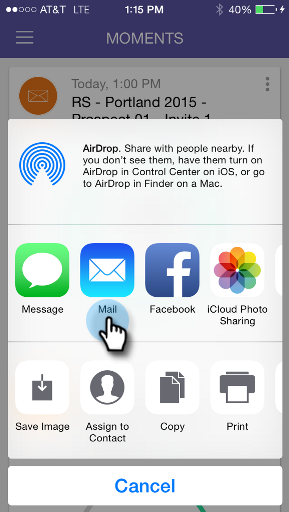

# 순간 공유 {#sharing-a-moment}

팀에 업데이트를 제공하시겠습니까? 공유를 선택할 수 있는 두 가지 옵션이 있습니다.

1. 탭 **공유** 카드의 아이콘

   

1. 카드 메뉴를 탭한 다음 을 탭합니다. **공유** 세부 정보 화면에서 다음을 수행합니다.

   

   

1. 공유할 방법을 선택하십시오. 이메일로 갑시다.

   >[!NOTE]
   >
   >공유는 휴대폰에 설치된 앱에 따라 다릅니다. 따라서 Facebook이 없으면 Moments에서 볼 수 없습니다.

   

1. 수신자의 주소, 제목을 입력하고 탭합니다. **보내기**.

   

   잘했어!
