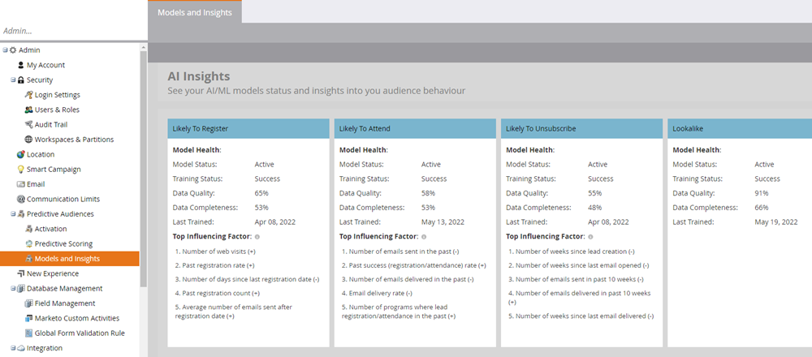

# 모델 및 인사이트 {#models-and-insights}

모델의 성능은 입력 데이터의 품질과 완전성에 따라 다릅니다. 각 가능성 AI 모델에 대한 상위 영향 요소를 참조하십시오. 이벤트 등록, 이벤트 참석 또는 구독 취소를 높이는 주요 요인도 살펴볼 수 있습니다.

>[!NOTE]
>
>(+)로 표시된 행동은 예측에 긍정적인 영향을 미친다(그 반대의 경우도 가능).

다음은 모델 상태를 평가하는 방법입니다.

Marketo Engage의 **[!UICONTROL Models and Data Health]** 영역에서 **[!UICONTROL Predictive Audiences]** 아래의 **[!UICONTROL Admin]** 섹션으로 이동합니다. 여기에서 모든 모델과 상태를 볼 수 있습니다.

* **교육 상태**: 모델이 적극적으로 교육하고 있는지 여부를 나타냅니다(예측 개선). 2주마다 자동으로 교육이 실시됩니다. _처리 중_&#x200B;인 모든 모델은 완료하는 데 최대 24시간이 걸릴 수 있습니다. _실패_ 모델의 경우 [Marketo 지원](https://nation.marketo.com/t5/Support/ct-p/Support){target="_blank"}에 문의하십시오.
* **채점 상태**: 모델이 프로그램 구성원에 대한 예측(가능성 백분율)을 적극적으로 계산하는지 여부를 나타냅니다.
* **성능**: 데이터 완전성 및 데이터 품질에 따라 모델 상태를 분류합니다(아래 참조).
* **데이터 완전성**: 현재/완료된 데이터 특성의 비율입니다.
* **데이터 품질**: 사용 가능한 좋은 데이터가 포함된 특성의 비율입니다.

* **마지막 교육**: 현재 모델과 2주마다 교육되는 새 모델 간의 평가에서 가장 좋은 모델의 날짜입니다.
