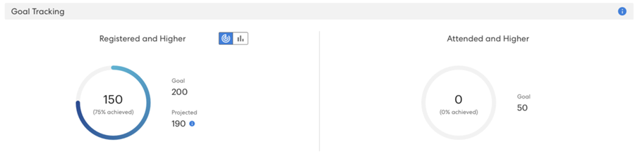
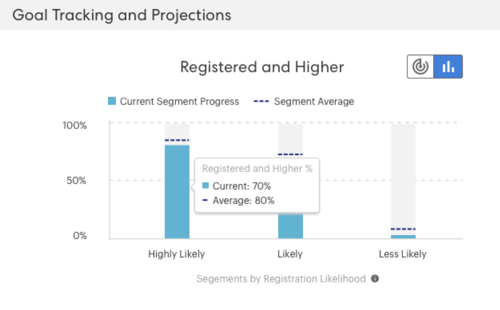
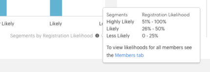

# 목표 추적 및 예상 등록 이해 {#understanding-goal-tracking-and-projected-registrations}

목표 진행 상황을 추적하고 Marketo의 예측을 이해하는 방법에 대해 설명합니다.

>[!PREREQUISITES]
>
>이러한 기능의 대부분에 액세스하려면 이벤트 프로그램에 대해 [next-gen toggle](/help/marketo/product-docs/marketo-engage-modern-ux/toggle-switch.md){target="_blank"}을(를) 활성화하십시오.

>[!NOTE]
>
>Marketo Classic 경험에서 이벤트 프로그램을 만들면 이벤트 시작 날짜가 현재 이벤트 생성 날짜로 기본 설정됩니다. 예상 등록은 이벤트 시작 일자 이전의 시간을 고려하므로 시작 일자와 생성 일자가 동일한 경우(의도적으로 설정하지 않은 경우) 이 숫자가 정확하지 않을 수 있습니다.

## 목표 추적 및 예상 등록

1. 이벤트 프로그램의 **[!UICONTROL 보고서]** 탭에서 목표 추적 세부 정보를 찾을 수 있습니다. 이 특정 예에서는 지금까지 200명(75%)의 목표에 대해 150명의 등록된 멤버가 있습니다.

   

**[!UICONTROL 예상]** 등록도 표시됩니다. 정보 아이콘 위로 마우스를 가져가면 가능성 세그먼트별로 이 숫자 분류를 볼 수 있습니다.

>[!NOTE]
>
>참석함 및 높음 차트는 이벤트 날짜까지 비어 있습니다.

전환 스위치를 활성화하지 않은 경우 Marketo 클래스 UI에 표시되는 방식은 다음과 같습니다.

1. 차트 토글을 클릭하여 등록 가능성별 멤버 분류로 전환합니다. 이전 프로그램의 해당 세그먼트에 대한 평균 백분율과 비교하여 각 세그먼트에 대한 현재 등록 백분율을 볼 수 있습니다.

   

모든 구성원(등록됨 및 아직 등록되지 않음)은 등록 가능성에 따라 분류됩니다. 정보 아이콘 위로 마우스를 가져가 이러한 가능성 범주가 정의되는 방식을 확인합니다.

>[!NOTE]
>
>예측 번호는 이벤트 당일까지 24시간마다 업데이트됩니다. _처리 중_(으)로 나열된 모든 구성원은 다음 계산 주기에 포함됩니다.

## 유사 프로그램

과거에 유사한 프로그램이 어떻게 수행되었는지 살펴봄으로써 현재 이벤트에 대한 통찰력을 얻을 수 있습니다. 이 섹션에는 지난 6개월 동안 _등록됨_ 이상인 구성원 수/비율과 함께 최대 5개의 유사한 프로그램이 표시됩니다.

유사한 프로그램을 계산할 때 다음과 같은 요소가 포함됩니다.

* 프로그램 유형
* 프로그램 채널
* 대상자 크기
* 프로그램 태그
* 이벤트 생성 후 이벤트 시작까지의 기간
* 이벤트 기간

  

## 추천 항목

[!UICONTROL 보고서] 페이지의 맨 위에서 진행 상황에 따라 AI/ML 기반 권장 사항을 찾을 수 있습니다. 유용한 팁과 통찰력을 정기적으로 확인하십시오!

## 개인 수준 예측

모든 프로그램 구성원을 보려면 **[!UICONTROL 구성원]** 탭을 클릭하십시오. **[!UICONTROL 등록 가능성]** 또는 **[!UICONTROL 출석 가능성]** 막대 위로 마우스를 가져가면 정확한 백분율과 분류를 확인할 수 있습니다. 그런 다음 특정 범주의 멤버(예: &quot;등록 가능성 낮음&quot;에 있는 모든 멤버)에 대해 조치를 취하고, 특히 등록 번호를 잠재적으로 높이기 위해 이들을 타깃팅할 수 있습니다.

>[!NOTE]
>
>개인 가능성은 프로필 속성, 개인 활동 및 과거 초대/등록/참석 활동을 포함하여 40개 이상의 개인 요소를 고려합니다.

## FAQ

**Q: 세그먼트는 무엇입니까?**

A: 등록 가능성이 0에서 100 사이의 값입니다. 이벤트 프로그램의 구성원인 모든 사람은 0에서 100 사이의 가능성 값을 받게 됩니다.

우리는 가능성 값을 세 개의 세그먼트에 넣습니다.

* 등록 가능성 >50% = 가능성이 높은 세그먼트
* &#x200B;>25%에서 &lt;50%로 등록 가능성 = 가능한 세그먼트
* 등록 가능성이 &lt;25% = 보다 낮음 세그먼트

등록 가능성이 높아지면 예측이 이러한 세그먼트 중 하나에 속하게 됩니다(프로그램의 구성원인 모든 사람은 이러한 세그먼트 중 하나에 속하게 됨). 예를 들어, 이벤트 프로그램에 가능성 예측을 기반으로 하는 구성원이 1000명인 경우, 해당 1000명은 _가능성이 높음_, _가능성이 높음_ 또는 _가능성이 낮음_ 세그먼트에 배포됩니다.

따라서 가능성 높음 세그먼트에 속하는 사람들은 이벤트에 등록할 가능성이 더 높습니다.

등록으로의 전환 = 등록된 세그먼트의 사람 수를 해당 세그먼트에 속하는 사람 수로 나눈 수입니다(예: 가능성이 높은 세그먼트에 100명이 속하고 이 중 60명이 등록하는 경우 전환율은 60%).

등록에 대한 전환율(%)은 가능성이 높음 > 가능성이 낮음 패턴을 따릅니다.

**Q: 인사이트를 어떻게 사용합니까?**

A: 우수 사례에는 다음이 포함됩니다.

i. 프로그램을 만든 다음 스마트 캠페인에서 &quot;X보다 큼&quot;의 예측 필터를 사용하여 특정 양의 사람(예: 1000명)이 발생하고 캠페인을 실행합니다.

아.. 24시간 후 [!UICONTROL 보고서] 탭에서 현재 초대된 모든 사람의 값을 등록할 가능성에 따라 계산된 예상 등록을 볼 수 있습니다.

iii. 예상 등록이 목표보다 적을 경우 더 많은 사람을 초대해야 합니다. 이 시점에서 과거 프로그램에서 작동한 임계값이 무엇이었는지 알려주는 인사이트를 확인할 수 있습니다.

iv. 해당 임계값으로 새 스마트 캠페인을 만들어 더 많은 사용자를 초대할 수 있습니다.

v. 언제든지 예상 숫자가 표시되는 이유를 이해하려면 전환하여 세그먼트 간의 대상 분포, 과거의 전환율을 보고 해당 전환율을 현재 대상에 적용할 수 있습니다(아래 스크린샷 참조).

**Q: 등록 그래프별 세그먼트는 무엇입니까?**

A: 각각 세그먼트를 나타내는 막대 3개(가능성 높음, 가능성 높음, 가능성 낮음).

**보라색 점선:** 유사한 이전 프로그램을 기준으로 해당 세그먼트에 등록된 평균 대화율입니다.

**파란색 막대:** 해당 세그먼트에 있는 모든 사람의 등록 비율입니다.

예를 들어 100명이 50% 이상 등록하고 100명 중 60명이 등록한다고 가정해 보겠습니다. 전환율은 60%입니다. 따라서 프로그램에 추가된 모든 멤버는 값을 등록할 가능성이 생기고, 그런 다음 세그먼트에 추가되며 각 세그먼트 전환율에 등록된 사람 수에 따라 계산됩니다.

**Q: &quot;등록됨 및 이상&quot;은 무엇을 의미합니까?**

A: 등록 또는 단계 번호가 같거나 더 높은 다른 상태로 나열되는 개인.

이벤트 프로그램에 대해 새로운 진행 상태를 생성할 수 있지만, 이러한 상태는 표준 상태로 매핑됩니다. 초대된 사람에서 다시 알림으로 이동하는 경우를 생각해 보십시오. 이는 등록보다 높은 단계입니다. 이 사람도 등록되고 목표 추적에 표시되는 것으로 간주됩니다.

**Q: 예상 등록은 어떻게 계산됩니까?**

A: 아래를 참조하십시오.

