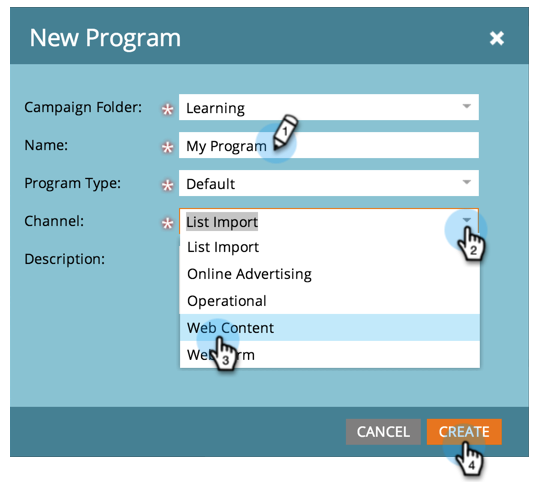

# 프로그램 {#create-a-program} 만들기

프로그램은 Marketing To에서 가장 중요한 요소 중 하나입니다. 많이 사용하게 될 거야!

1. **마케팅 활동**&#x200B;으로 이동합니다.

   

1. 새 프로그램의 폴더를 선택합니다. **새로 만들기**&#x200B;를 선택하고 **새 프로그램**&#x200B;을 클릭합니다.

   

1. **이름**&#x200B;을 입력하고 드롭다운에서 **[채널](http://docs.marketo.com/display/DOCS/Create+a+Program+Channel)**&#x200B;을 선택하고 **만들기**&#x200B;를 클릭합니다.

   

>[!MORELIKETHIS]
>
>[프로그램 이해를 참조하십시오](/help/marketo/product-docs/core-marketo-concepts/programs/creating-programs/understanding-programs.md).
