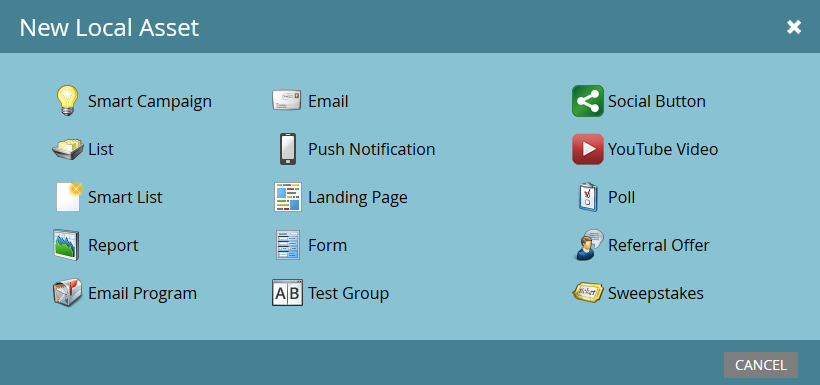

# 프로그램에서 로컬 자산 이해 {#understanding-local-assets-in-a-program}

로컬 에셋은 프로그램을 구성하는 콘텐츠입니다. Assets은 사용자 정의가 가능하며 자동화된 마케팅 이니셔티브를 구축할 수 있도록 해줍니다. 다음은 프로그램에서 만들 수 있는 대부분의 로컬 에셋입니다.

>[!NOTE]
>
>모든 사용자가 사용 가능한 모든 자산에 액세스할 수 있는 것은 아닙니다. 자세한 내용은 Adobe 계정 팀(계정 관리자)에 문의하십시오.

* [스마트 캠페인](/help/marketo/product-docs/core-marketo-concepts/smart-campaigns/creating-a-smart-campaign/understanding-batch-and-trigger-smart-campaigns.md){target="_blank"}
* [목록](/help/marketo/product-docs/core-marketo-concepts/smart-lists-and-static-lists/static-lists/understanding-static-lists.md){target="_blank"}
* [스마트 목록](/help/marketo/product-docs/core-marketo-concepts/smart-lists-and-static-lists/creating-a-smart-list/create-a-smart-list.md){target="_blank"}
* [보고서](/help/marketo/product-docs/reporting/basic-reporting/report-types/report-type-overview.md){target="_blank"}
* [이메일 프로그램](/help/marketo/product-docs/email-marketing/email-programs/creating-an-email-program/understanding-email-programs.md){target="_blank"}
* [이메일](/help/marketo/product-docs/email-marketing/email-programs/email-program-actions/create-an-email-for-an-email-program.md){target="_blank"}
* [푸시 알림](/help/marketo/product-docs/mobile-marketing/push-notifications/understanding-push-notifications.md){target="_blank"}
* [랜딩 페이지](/help/marketo/product-docs/demand-generation/landing-pages/understanding-landing-pages/understanding-free-form-vs-guided-landing-pages.md){target="_blank"}
* [양식](/help/marketo/product-docs/demand-generation/forms/creating-a-form/create-a-form.md){target="_blank"}
* [테스트 그룹](/help/marketo/product-docs/demand-generation/landing-pages/understanding-landing-pages/landing-page-test-groups.md){target="_blank"}
* [Vibes SMS 메시지](/help/marketo/product-docs/mobile-marketing/vibes-sms-messages/create-an-sms-message.md){target="_blank"}
