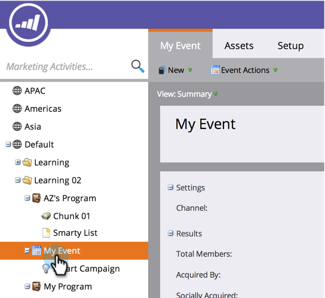

# 프로그램 홈 탭 사용 {#using-the-program-home-tab}

프로그램 홈 탭에서는 프로그램의 진행 상황을 세부적으로 볼 수 있습니다.

## 요약 보기 {#summary-view}

1. **[!UICONTROL Marketing Activities]**(으)로 이동합니다.

   

1. 프로그램을 선택합니다.

   

   >[!NOTE]
   >
   >기본 보기입니다. 설정, 일정, 결과 및 구성원 프로그램 상태에 대한 정보를 제공합니다.

1. 내용을 변경하거나 더 많은 정보를 보려면 밑줄이 있는 요소를 클릭하십시오.

   

1. 보고서를 다운로드하려면 요약 하단의 **[!UICONTROL Export]**&#x200B;을(를) 클릭하십시오.

   

## 보기에서 사용됨 {#used-by-view}

1. **[!UICONTROL Marketing Activities]**&#x200B;에서 프로그램을 선택하십시오.

   

1. **[!UICONTROL View]** 드롭다운을 클릭합니다. **[!UICONTROL Used By]**&#x200B;를 선택합니다.

   

   이 보기는 사용 중인 스마트 캠페인을 보여 줍니다.

   

## 멤버십 보기 {#membership-view}

1. **[!UICONTROL Marketing Activities]**&#x200B;에서 프로그램을 선택하십시오.

   

1. **[!UICONTROL View]** 드롭다운을 클릭합니다. **[!UICONTROL Membership]**&#x200B;를 선택합니다.

   

   이는 멤버가 프로그램 상태를 이동할 때 현재 위치에 대한 그래프를 보여 줍니다.

   

   >[!NOTE]
   >
   >**[!UICONTROL Historical]**&#x200B;은(는) 프로그램을 거친 사용자를 나타내며, **[!UICONTROL Current]**&#x200B;에는 현재 프로그램에 있는 사람만 포함됩니다.

   >[!MORELIKETHIS]
   >
   >[프로그램 구성원 이해](/help/marketo/product-docs/core-marketo-concepts/programs/creating-programs/understanding-program-membership.md){target="_blank"}
