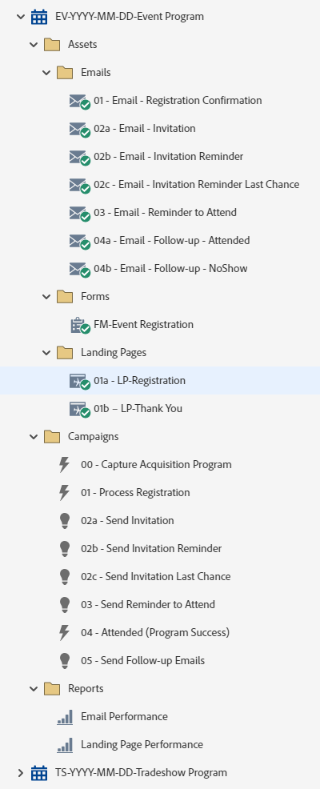

# EV-YYYY-MM-DD-이벤트 프로그램 {#ev-yyyy-mm-dd-event-program}

다음은 Marketo Engage 이벤트 프로그램을 활용하는 등록 페이지, 3개의 초대 이메일 및 후속 이메일이 있는 이벤트 프로그램의 예입니다. 로드쇼, 점심 식사, 저녁 식사 또는 무역 박람회 행사의 프레젠테이션을 포함하여 등록이 필요한 모든 이벤트에 적합합니다.

추가 전략 지원 또는 프로그램 사용자 지정에 도움이 필요하면 Adobe 계정 팀에 문의하거나 [Adobe Professional Services](https://business.adobe.com/customers/consulting-services/main.html){target="_blank"} 페이지를 방문하십시오.

## 채널 요약 {#channel-summary}

<table style="table-layout:auto">
 <tbody>
  <tr>
   <th>채널</th>
   <th>멤버십 상태</th>
   <th>Analytics 동작</th>
   <th>프로그램 유형</th>
  </tr>
  <tr>
   <td>이벤트</td>
   <td>01-초대됨
대기자 명단에 등록된  02
 03-등록됨
 04-표시 안 함
 05-참석-성공</td>
   <td>포함</td>
   <td>이벤트</td>
  </tr>
 </tbody>
</table>

## 프로그램에는 다음 Assets이 포함되어 있습니다 {#program-contains-the-following-assets}

<table style="table-layout:auto">
 <tbody>
  <tr>
   <th>유형</th>
   <th>템플릿 이름</th>
   <th>에셋 이름</th>
  </tr>
  <tr>
   <td>이메일</td>
   <td><a href="/help/marketo/product-docs/core-marketo-concepts/programs/program-library/quick-start-email-template.md" target="_blank">빠른 시작 이메일 템플릿</a></td>
   <td>01-이메일-감사</td>
  </tr>
   <tr>
   <td>이메일</td>
   <td><a href="/help/marketo/product-docs/core-marketo-concepts/programs/program-library/quick-start-email-template.md" target="_blank">빠른 시작 이메일 템플릿</a></td>
   <td>02a- 이메일 - 초대</td>
  </tr>
  <tr>
   <td>이메일</td>
   <td><a href="/help/marketo/product-docs/core-marketo-concepts/programs/program-library/quick-start-email-template.md" target="_blank">빠른 시작 이메일 템플릿</a></td>
   <td>02b - 이메일 - 초대 미리 알림</td>
  </tr>
  <tr>
   <td>이메일</td>
   <td><a href="/help/marketo/product-docs/core-marketo-concepts/programs/program-library/quick-start-email-template.md" target="_blank">빠른 시작 이메일 템플릿</a></td>
   <td>02c- 이메일 - 초대 미리 알림 마지막 기회</td>
  </tr>
  <tr>
   <td>이메일</td>
   <td><a href="/help/marketo/product-docs/core-marketo-concepts/programs/program-library/quick-start-email-template.md" target="_blank">빠른 시작 이메일 템플릿</a></td>
   <td>03 - 이메일 - 참석 알림 메시지</td>
  </tr>
  <tr>
   <td>이메일</td>
   <td><a href="/help/marketo/product-docs/core-marketo-concepts/programs/program-library/quick-start-email-template.md" target="_blank">빠른 시작 이메일 템플릿</a></td>
   <td>04a - 이메일 - 후속 작업 - 참석함</td>
  </tr>
  <tr>
   <td>이메일</td>
   <td><a href="/help/marketo/product-docs/core-marketo-concepts/programs/program-library/quick-start-email-template.md" target="_blank">빠른 시작 이메일 템플릿</a></td>
   <td>04b - 이메일 - 후속 작업 - NoShow</td>
  </tr>
  <tr>
   <td>랜딩 페이지</td>
   <td><a href="/help/marketo/product-docs/core-marketo-concepts/programs/program-library/quick-start-landing-page-template.md" target="_blank">빠른 시작 LP 템플릿</a></td>
   <td>01a - LP - 등록</td>
  </tr>
  <tr>
   <td>랜딩 페이지</td>
   <td><a href="/help/marketo/product-docs/core-marketo-concepts/programs/program-library/quick-start-landing-page-template.md" target="_blank">빠른 시작 LP 템플릿</a></td>
   <td>01b - LP - 감사합니다.</td>
  </tr>
  <tr>
   <td>양식</td>
   <td> </td>
   <td>FM-이벤트 등록</td>
  </tr>
  <tr>
   <td>로컬 보고서</td>
   <td> </td>
   <td>이메일 성능</td>
  </tr>
  <tr>
   <td>로컬 보고서</td>
   <td> </td>
   <td>랜딩 페이지 성능</td>
  </tr>
  <tr>
   <td>스마트 캠페인</td>
   <td> </td>
   <td>00 - 획득 프로그램 캡처</td>
  </tr>
  <tr>
   <td>스마트 캠페인</td>
   <td> </td>
   <td>01 - 프로세스 등록</td>
  </tr>
   <tr>
   <td>스마트 캠페인</td>
   <td> </td>
   <td>02a - 초대 보내기</td>
  </tr>
   <tr>
   <td>스마트 캠페인</td>
   <td> </td>
   <td>02b - 초대 알림 보내기</td>
  </tr>
   <tr>
   <td>스마트 캠페인</td>
   <td> </td>
   <td>02c - 마지막 기회 초대 보내기</td>
  </tr>
   <tr>
   <td>스마트 캠페인</td>
   <td> </td>
   <td>03 - 참석하도록 미리 알림 보내기</td>
  </tr>
   <tr>
   <td>스마트 캠페인</td>
   <td> </td>
   <td>04 - 참석함(프로그램 성공)</td>
  </tr>
   <tr>
   <td>스마트 캠페인</td>
   <td> </td>
   <td>05 - 후속 이메일 보내기</td>
  </tr>
  <tr>
   <td>폴더</td>
   <td> </td>
   <td>Assets - 모든 크리에이티브 에셋 보유
 (전자 메일 및 랜딩 페이지의 하위 폴더)</td>
  </tr>
  <tr>
   <td>폴더</td>
   <td> </td>
   <td>캠페인 - 모든 스마트 캠페인 저장</td>
  </tr>
  <tr>
   <td>폴더</td>
   <td> </td>
   <td>보고서</td>
  </tr>
 </tbody>
</table>

## 내 토큰이 포함됨 {#my-tokens-included}

<table style="table-layout:auto">
 <tbody>
  <tr>
   <th>토큰 유형</th>
   <th>토큰 이름</th>
   <th>값</th>
  </tr>
  <tr>
   <td>캘린더 파일</td>
   <td><code>{{my.AddToCalendar}}</code></td>
   <td>세부 사항을 보려면 두 번 클릭</td>
  </tr>
  <tr>
   <td>텍스트</td>
   <td><code>{{my.Email-FromAddress}}</code></td>
   <td>PlaceholderFrom.email@mydomain.com</td>
  </tr>
  <tr>
   <td>텍스트</td>
   <td><code>{{my.Email-FromName}}</code></td>
   <td><code><--My From Name Here--></code></td>
  </tr>
  <tr>
   <td>텍스트</td>
   <td><code>{{my.Email-ReplyToAddress}}</code></td>
   <td>reply-to.email@mydomain.com</td>
  </tr>
  <tr>
   <td>텍스트</td>
   <td><code>{{my.Event-Date}}</code></td>
   <td><code><--My Event Date--></code></td>
  </tr>
   <tr>
   <td>리치 텍스트</td>
   <td><code>{{my.Content-Description}}</code></td>
   <td>세부 사항을 보려면 두 번 클릭
 <code><--My Content Description Here--></code>
 내 토큰 탭의 프로그램 수준에서 이 콘텐츠 설명을 편집합니다.
 배울 내용:
<li>글머리 기호</li>
<li>글머리 기호 2</li>
<li>글머리 기호 3</li></td>
  </tr>
  <tr>
   <td>텍스트</td>
   <td><code>{{my.Event-Location-Line1}}</code></td>
   <td><code><--XYZ Hotel--></code></td>
  </tr>
   <tr>
   <td>텍스트</td>
   <td><code>{{my.Event-Location-Line2}}</code></td>
   <td><code><--ABC Room--></code></td>
  </tr>
   <tr>
   <td>텍스트</td>
   <td><code>{{my.Event-Location-Line3}}</code></td>
   <td><code><--1234 Anystreet--></code></td>
  </tr>
  <tr>
   <td>텍스트</td>
   <td><code>{{my.Event-Location-Line4}}</code></td>
   <td><code><--Anytown, ZZ 99999--></code></td>
  </tr>
  <tr>
   <td>텍스트</td>
   <td><code>{{my.Event-Time}}</code></td>
   <td><code><--My Event Time + TimeZone--></code></td>
  </tr>
  <tr>
   <td>텍스트</td>
   <td><code>{{my.Event-Title}}</code></td>
   <td><code><--My Event Title Here--></code></td>
  </tr>
  <tr>
   <td>텍스트</td>
   <td><code>{{my.Event-Type}}</code></td>
   <td>라이브 이벤트</td>
  </tr>
  <tr>
   <td>텍스트</td>
   <td><code>{{my.PageURL-Download}}</code></td>
   <td>my.DownloadURL?without=http://</td>
  </tr>
  <tr>
   <td>텍스트</td>
   <td><code>{{my.PageURL-Registration}}</code></td>
   <td>my.RegistrationPageURL?without=http://</td>
  </tr>
  <tr>
   <td>텍스트</td>
   <td><code>{{my.PageURL-ThankYou}}</code></td>
   <td>my.ThankYouPageURL?without=http://</td>
  </tr>
  <tr>
   <td>텍스트</td>
   <td><code>{{my.Speaker1-Name}}</code></td>
   <td><code><--Speaker Name Here--></code></td>
  </tr>
  <tr>
   <td>텍스트</td>
   <td><code>{{my.Speaker1-Title}}</code></td>
   <td><code><--Speaker Title Here--></code></td>
  </tr>
  <tr>
   <td>텍스트</td>
   <td><code>{{my.Speaker2-Name}}</code></td>
   <td><code><--Speaker Name Here--></code></td>
  </tr>
  <tr>
   <td>텍스트</td>
   <td><code>{{my.Speaker2-Title}}</code></td>
   <td><code><--Speaker Title Here--></code></td>
  </tr>
  <tr>
   <td>텍스트</td>
   <td><code>{{my.Speaker3-Name}}</code></td>
   <td><code><--Speaker Name Here--></code></td>
  </tr>
 <tr>
   <td>텍스트</td>
   <td><code>{{my.Speaker3-Title}}</code></td>
   <td><code><--Speaker Title Here--></code></td>
  </tr>
 </tbody>
</table>

## 충돌 규칙 {#conflict-rules}

* **프로그램 태그**
   * 이 구독에서 태그 만들기 - _권장_
   * 무시

* **같은 이름의 랜딩 페이지 템플릿**
   * 원본 템플릿 복사
   * 대상 템플릿 사용 - _권장_

* **이름이 같은 이미지**
   * 두 파일 모두 보관
   * 이 구독의 항목 바꾸기 - _권장_

* **같은 이름의 전자 메일 서식 파일**
   * 두 템플릿 모두 유지
   * 기존 템플릿 바꾸기 - _권장_

## 우수 사례 {#best-practices}

* 웨비나 프로그램을 가져온 후 양식을 로컬 에셋에서 Design Studio에 있는 글로벌 에셋으로 이동합니다.
   * Design Studio에서 양식 수를 줄이고 더 많은 글로벌 에셋을 사용하면 프로그램 설계 및 관리 거버넌스에서 더 많은 확장성을 얻을 수 있습니다. 또한 필드, 옵트인 언어 등에 대한 정기적인 규정 준수 업데이트의 유연성을 제공합니다.

* 현재 브랜드 템플릿을 활용하도록 가져온 프로그램의 템플릿을 업데이트하거나, 코드 조각 또는 적절한 로고/바닥글 정보에 추가하여 브랜드를 반영하도록 새로 가져온 템플릿을 업데이트하는 것이 좋습니다.

* 명명 규칙에 맞게 이 프로그램 예제의 명명 규칙을 업데이트하는 것이 좋습니다.

>[!NOTE]
>
>프로그램 템플릿에서 내 토큰 값 을 업데이트하고 필요할 때 프로그램을 사용할 때마다 업데이트합니다.

>[!TIP]
>
>성공 추적을 위해 &quot;06-참석(프로그램 성공)&quot; 캠페인을 활성화하는 것을 잊지 마십시오! 양식이 라이브되고 전자 메일이 전송되기 전에 _먼저_&#x200B;하세요.

>[!IMPORTANT]
>
>URL을 참조하는 내 토큰은 http:// 또는 https://을 포함할 수 없습니다. 그렇지 않으면 링크가 자산 내에서 적절하게 작동하지 않습니다.
