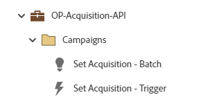

# OP-Acquisition-API {#op-acquisition-api}

이 예제 프로그램은 Marketo Engage 기본 프로그램을 사용하여 API 소스에서 레코드 획득을 추적하는 운영 프로세스를 위한 것입니다.

## 채널 요약 {#channel-summary}

<table style="table-layout:auto"> 
 <tbody> 
  <tr> 
   <th>채널</th> 
   <th>멤버십 상태</th>
   <th>Analytics 동작</th>
   <th>프로그램 유형</th>
  </tr> 
  <tr> 
   <td>운영</td> 
   <td>구성원</td>
   <td>운영</td>
   <td>기본</td>
  </tr>
 </tbody> 
</table>

## 프로그램에는 다음 Assets이 포함되어 있습니다 {#program-contains-the-following-assets}

<table style="table-layout:auto"> 
 <tbody> 
  <tr> 
   <th>유형</th> 
   <th>템플릿 이름</th>
   <th>에셋 이름</th>
  </tr>
  <tr> 
   <td>스마트 캠페인</td> 
   <td> </td>
   <td>획득 설정 - 일괄 처리</td>
  </tr>
  <tr> 
   <td>스마트 캠페인</td> 
   <td> </td>
   <td>획득 설정 - 트리거</td>
  </tr>
  <tr> 
   <td>폴더</td> 
   <td> </td>
   <td>캠페인(모든 스마트 캠페인 포함)</td>
  </tr>
 </tbody> 
</table>

## 충돌 규칙 {#conflict-rules}

* **프로그램 태그**
   * 이 구독에서 태그 만들기 - _권장_
   * 무시

* **같은 이름의 랜딩 페이지 템플릿**
   * 원본 템플릿 복사 - _권장_
   * 대상 템플릿 사용

* **이름이 같은 이미지**
   * 두 파일 모두 보관 - _권장_
   * 이 구독의 항목 바꾸기

* **같은 이름의 전자 메일 서식 파일**
   * 두 템플릿 모두 보관 - _권장_
   * 기존 템플릿 바꾸기

## 우수 사례 {#best-practices}

* 데이터 관리를 자세히 살펴야 하는 경우 먼저 일괄 처리 캠페인을 실행합니다.

* CRM 또는 데이터 통합을 포함하도록 모든 입력 소스에서 모범 사례에 맞게 정렬하도록 유사한 프로그램을 활용하는 것이 좋습니다.

* 채널별 채널 마케팅 이니셔티브 내에서 필요한 경우 고객 확보를 캡처해야 합니다.
