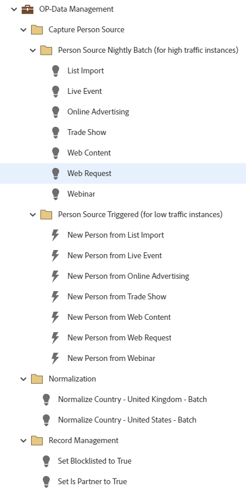

# OP-데이터 관리 {#op-data-management}

다음은 Marketo Engage 데이터베이스 내의 레코드에 대한 데이터 일관성을 관리하는 데 도움이 되는 기본 프로그램을 사용하는 간단한 운영 데이터 관리 모범 사례 워크플로의 예입니다.

추가적인 전략 지원 또는 프로그램 맞춤화에 대한 도움말을 보려면 Adobe 계정 팀에 문의하거나 [Adobe Professional Services](https://business.adobe.com/customers/consulting-services/main.html){target="_blank"} 페이지를 가리키도록 업데이트하는 중입니다.

## 채널 요약 {#channel-summary}

<table style="table-layout:auto"> 
 <tbody> 
  <tr> 
   <th>채널</th> 
   <th>멤버십 상태</th>
   <th>Analytics 동작</th>
   <th>프로그램 유형</th>
  </tr> 
  <tr> 
   <td>운영</td> 
   <td>구성원</td>
   <td>운영</td>
   <td>기본값</td>
  </tr>
 </tbody> 
</table>

## 프로그램에 다음 자산이 포함되어 있습니다. {#program-contains-the-following-assets}

<table style="table-layout:auto"> 
 <tbody> 
  <tr> 
   <th>유형</th> 
   <th>템플릿 이름</th>
   <th>에셋 이름</th>
  </tr>
  <tr> 
   <td>스마트 캠페인</td> 
   <td> </td>
   <td>국가 정상화 - 미국</td>
  </tr>
  <tr> 
   <td>스마트 캠페인</td> 
   <td> </td>
   <td>Normalize 국가 - 영국</td>
  </tr>
  <tr> 
   <td>스마트 캠페인</td> 
   <td> </td>
   <td>차단 목록에 추가된을 True로 설정</td>
  </tr>
  <tr> 
   <td>스마트 캠페인</td> 
   <td> </td>
   <td>파트너임을 True로 설정</td>
  </tr>
  <tr> 
   <td>스마트 캠페인</td> 
   <td> </td>
   <td>목록 가져오기</td>
  </tr>
  <tr> 
   <td>스마트 캠페인</td> 
   <td> </td>
   <td>라이브 이벤트</td>
  </tr>
  <tr> 
   <td>스마트 캠페인</td> 
   <td> </td>
   <td>온라인 광고</td>
  </tr>
  <tr> 
   <td>스마트 캠페인</td> 
   <td> </td>
   <td>무역 박람회</td>
  </tr>
  <tr> 
   <td>스마트 캠페인</td> 
   <td> </td>
   <td>웹 컨텐츠</td>
  </tr>
  <tr> 
   <td>스마트 캠페인</td> 
   <td> </td>
   <td>웹 요청</td>
  </tr>
  <tr> 
   <td>스마트 캠페인</td> 
   <td> </td>
   <td>웨비나</td>
  </tr>
  <tr> 
   <td>스마트 캠페인</td> 
   <td> </td>
   <td>목록 가져오기에서 새 사용자</td>
  </tr>
  <tr> 
   <td>스마트 캠페인</td> 
   <td> </td>
   <td>라이브 이벤트에서 새 사용자</td>
  </tr>
  <tr> 
   <td>스마트 캠페인</td> 
   <td> </td>
   <td>온라인 광고의 새로운 사람</td>
  </tr>
  <tr> 
   <td>스마트 캠페인</td> 
   <td> </td>
   <td>무역 박람회의 새로운 사람</td>
  </tr>
   <tr> 
   <td>스마트 캠페인</td> 
   <td> </td>
   <td>웹 콘텐츠의 새 사용자</td>
  </tr>
   <tr> 
   <td>스마트 캠페인</td> 
   <td> </td>
   <td>웹 요청의 새 사용자</td>
  </tr>
   <tr> 
   <td>스마트 캠페인</td> 
   <td> </td>
   <td>웨비나의 새 사용자</td>
  </tr>
  <tr> 
   <td>폴더</td> 
   <td> </td>
   <td>개인 소스 야간 일괄 처리(높은 트래픽 인스턴스의 경우)</td>
  </tr>
  <tr> 
   <td>폴더</td> 
   <td> </td>
   <td>개인 소스가 트리거됨(낮은 트래픽 인스턴스의 경우)</td>
  </tr>
  <tr> 
   <td>폴더</td> 
   <td> </td>
   <td>개인 소스 캡처</td>
  </tr>
  <tr> 
   <td>폴더</td> 
   <td> </td>
   <td>표준화</td>
  </tr>
  <tr> 
   <td>폴더</td> 
   <td> </td>
   <td>기록 관리</td>
  </tr>
  <tr> 
   <td>폴더</td> 
   <td> </td>
   <td>차단 목록</td>
  </tr>
 </tbody> 
</table>

## 충돌 규칙 {#conflict-rules}

* **프로그램 태그**
   * 이 구독에서 태그 만들기 - _추천_
   * 무시

* **동일한 이름의 랜딩 페이지 템플릿**
   * 원본 템플릿 복사 - _추천_
   * 대상 템플릿 사용

* **이름이 같은 이미지**
   * 두 파일 모두 보관 - _추천_
   * 이 구독의 항목 바꾸기

* **이름이 같은 이메일 템플릿**
   * 두 템플릿 모두 유지 - _추천_
   * 기존 템플릿 바꾸기

## 우수 사례 {#best-practices}

* 빌드된 각 캠페인은 사용 사례에만 국한되지 않고 모범 사례 빌드에 대한 예시여야 합니다. 구체적인 해결 과제 및 데이터 문제를 해결하기 위해 스마트 캠페인을 업데이트해야 합니다.

* 명명 규칙에 맞게 이 프로그램 예제의 명명 규칙을 업데이트하는 것이 좋습니다.
