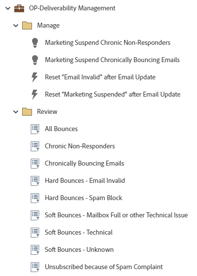

# OP-Deliverability Management {#op-deliverability-management}

다음은 Marketo Engage 기본 프로그램을 활용하여 현재 이메일 게재 상태를 검토하고 만성 바운스 및 비응답자를 관리하는 게재 가능성 관리 모범 사례 워크플로의 예입니다.

>[!NOTE]
>
>가져오려면 사용자 지정 문자열 필드 &quot;마케팅 중단 이유&quot;가 필요합니다. [자세히 알아보기](https://nation.marketo.com/community/product_and_support/support_solutions/blog/2016/04/18/how-to-monitor-deliverability-using-marketo){target="_blank"}

추가 전략 지원 또는 프로그램 사용자 지정에 도움이 필요하면 Adobe 계정 팀에 문의하거나 [Adobe Professional Services](https://business.adobe.com/customers/consulting-services/main.html){target="_blank"} 페이지를 방문하십시오.

## 채널 요약 {#channel-summary}

<table style="table-layout:auto">
 <tbody>
  <tr>
   <th>채널</th>
   <th>멤버십 상태</th>
   <th>Analytics 동작</th>
   <th>프로그램 유형</th>
  </tr>
  <tr>
   <td>운영</td>
   <td>구성원</td>
   <td>운영</td>
   <td>기본</td>
  </tr>
 </tbody>
</table>

## 전제 조건 필드 {#prerequisite-fields}

<table style="table-layout:auto">
 <tbody>
  <tr>
   <th>유형</th>
   <th>알기 쉬운 이름</th>
   <th>API 이름</th>
  </tr>
  <tr>
   <td>문자열</td>
   <td>마케팅 중단 사유</td>
   <td>MarketingSuspendReason</td>
  </tr>
 </tbody>
</table>

## 프로그램에는 다음 Assets이 포함되어 있습니다 {#program-contains-the-following-assets}

<table style="table-layout:auto">
 <tbody>
  <tr>
   <th>유형</th>
   <th>템플릿 이름</th>
   <th>에셋 이름</th>
  </tr>
  <tr>
   <td>스마트 캠페인</td>
   <td> </td>
   <td>마케팅 일시 중단 만성 비응답자</td>
  </tr>
  <tr>
   <td>스마트 캠페인</td>
   <td> </td>
   <td>마케팅 일시 중단 만성 바운싱 이메일</td>
  </tr>
  <tr>
   <td>스마트 캠페인</td>
   <td> </td>
   <td>이메일 업데이트 후 "이메일 잘못됨" 재설정</td>
  </tr>
  <tr>
   <td>스마트 캠페인</td>
   <td> </td>
   <td>이메일 업데이트 후 "마케팅 일시 중단됨" 재설정</td>
  </tr>
  <tr>
   <td>폴더</td>
   <td> </td>
   <td>관리</td>
  </tr>
  <tr>
   <td>폴더</td>
   <td> </td>
   <td>검토</td>
  </tr>
 </tbody>
</table>

## 충돌 규칙 {#conflict-rules}

* **프로그램 태그**
   * 이 구독에서 태그 만들기 - _권장_
   * 무시

* **같은 이름의 랜딩 페이지 템플릿**
   * 원본 템플릿 복사 - _권장_
   * 대상 템플릿 사용

* **이름이 같은 이미지**
   * 두 파일 모두 보관 - _권장_
   * 이 구독의 항목 바꾸기

* **같은 이름의 전자 메일 서식 파일**
   * 두 템플릿 모두 보관 - _권장_
   * 기존 템플릿 바꾸기

## 우수 사례 {#best-practices}

* 빌드된 각 캠페인은 사용 사례에만 국한되지 않고 모범 사례 빌드에 대한 예시여야 합니다. 구체적인 해결 과제 및 데이터 문제를 해결하기 위해 스마트 캠페인을 업데이트해야 합니다.

* 명명 규칙에 맞게 이 프로그램 예제의 명명 규칙을 업데이트하는 것이 좋습니다.
