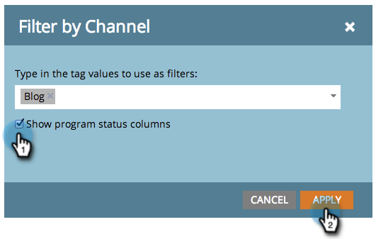

# 프로그램 보고서에 프로그램 상태 열 추가 {#add-program-status-columns-to-a-program-report}

프로그램 상태에 대한 통계를 [프로그램 성과 보고서에 추가합니다](create-a-program-performance-report.md).

1. 마케팅 활동(또는 분석)으로 이동합니다.

   

1. 보고서를 선택합니다.

   

1. 설정 탭을 클릭하고 채널 태그 위로 드래그합니다.

   

1. 필터링할 채널을 선택합니다.

   

   >[!TIP]
   >
   >프로그램 상태 열을 표시하려면 보고서를 *하나의* 채널로 필터링해야 합니다.

1. 프로그램 상태 열 표시 옵션을 선택합니다. 적용을 클릭합니다.

   

1. 네가 해냈어! 보고서 탭을 클릭하여 프로그램 상태 열이 있는 보고서를 봅니다.

   

>[!NOTE]
>
>프로그램의 각 상태에 대한 열이 표시되지 않으면 보고서에 표시할 열을 [선택했는지](../../../../product-docs/reporting/basic-reporting/editing-reports/select-report-columns.md) 확인하십시오.

>[!NOTE]
>
>**관련 문서**
>
>* [태그를 기준으로 프로그램 보고서 필터링](filter-a-program-report-by-tag.md)

>

>[!NOTE]
>
>**딥 다이브**
>
>기본 보고의 자세한 [내용을 살펴보십시오](http://docs.marketo.com/display/docs/basic+reporting).

