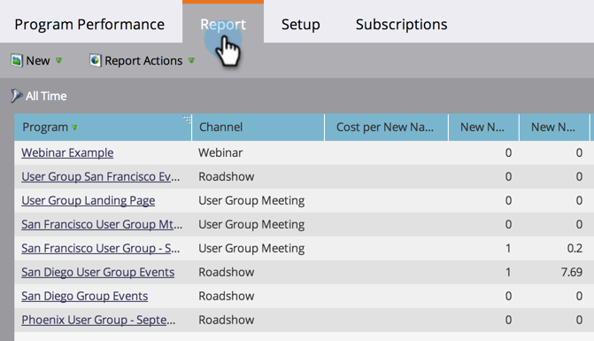

# 프로그램 성능 보고서 만들기 {#create-a-program-performance-report}

이 보고서를 통해 프로그램의 상태를 확인하십시오.

1. [프로그램에서](../../../../product-docs/reporting/basic-reporting/creating-reports/create-a-report-in-a-program.md) 보고서를 만들고 **프로그램 성능** 보고서 유형을 [선택합니다](../../../../product-docs/reporting/basic-reporting/report-types/report-type-overview.md).
1. 보고서 **탭을** 클릭합니다.
1. 거기 있어! 보고서에서 프로그램의 이용 현황을 확인할 수 있습니다.

   

>[!TIP]
>
>성공당 *비용*&#x200B;이 가장 낮은 프로그램을 찾으려면 해당 열을 기준으로 보고서 [를](../../../../product-docs/reporting/basic-reporting/editing-reports/sort-report-on-columns.md) 정렬하고 오름차순 **정렬을**&#x200B;선택합니다.

프로그램 성능 보고서의 열에는 다음과 같은 내용이 포함됩니다.

<table> 
 <thead> 
  <tr> 
   <th>열</th> 
   <th>설명</th> 
  </tr> 
 </thead> 
 <tbody> 
  <tr> 
   <td>채널</td> 
   <td>프로그램의 채널 유형입니다.</td> 
  </tr> 
  <tr> 
   <td>새 이름</td> 
   <td>이 프로그램에서 획득한 신규 사용자</td> 
  </tr> 
  <tr> 
   <td>성공</td> 
   <td>프로그램 상태에 정의된 성공 멤버 수입니다. </td> 
  </tr> 
  <tr> 
   <td>총 비용</td> 
   <td>
프로그램 내의 모든 기간 비용의 합계입니다.
</td> 
  </tr> 
 </tbody> 
</table>

>[!NOTE]
>
>**딥 다이브**
>
>기본 보고의 자세한 [내용을 살펴보십시오](http://docs.marketo.com/display/docs/basic+reporting).

