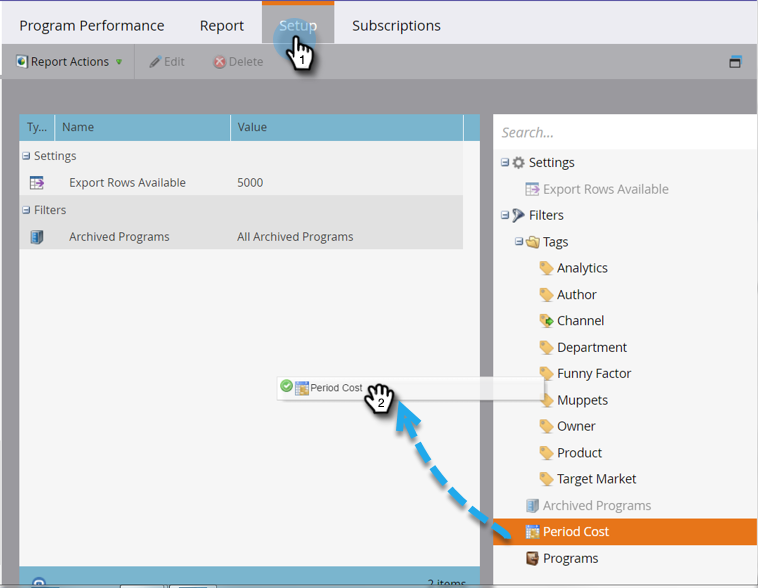

# 기간 비용 {#filter-a-program-report-by-period-cost}별로 프로그램 보고서 필터링

특정 기간 비용 기간에 [프로그램 성과 보고서](create-a-program-performance-report.md)를 집중하십시오.

1. **Marketing** **활동**(또는 **Analytics**)으로 이동합니다.

   

1. 프로그램 성과 보고서를 선택합니다.

   

1. **설정** 탭을 클릭하고 **기간 비용** 위로 드래그합니다.

   

1. **From** 및 **To** 날짜에 발생한 비용을 입력하고 **적용**&#x200B;을 클릭합니다.

   

1. 다 끝났어! 지정된 기간 비용 기간에 해당하는 프로그램만 보려면 **보고서** 탭을 클릭합니다.

   

   >[!NOTE]
   >
   >**관련 문서**
   >
   >    
   >    
   >    * [프로그램별 프로그램 보고서 필터링](filter-a-program-report-by-program.md)

   >[!NOTE]
   >
   >**자세히 알아보기**
   >
   >
   >[기본 보고](http://docs.marketo.com/display/docs/basic+reporting)의 보고서에 대해 모두 알아봅니다.

