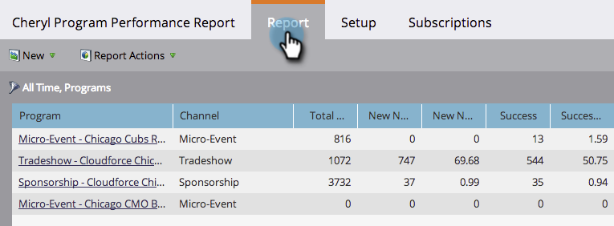

# 프로그램별로 프로그램 보고서 필터링 {#filter-a-program-report-by-program}

[프로그램 성과 보고서](/help/marketo/product-docs/core-marketo-concepts/programs/program-performance-report/create-a-program-performance-report.md){target="_blank"}를 특정 프로그램에 집중하여 성과를 비교합니다.

1. **[!UICONTROL Marketing Activities]**(또는 **[!UICONTROL Analytics]**)(으)로 이동합니다.

   

1. 프로그램 성과 보고서를 선택합니다.

   

1. **[!UICONTROL Setup]** 탭을 클릭하고 **[!UICONTROL Programs]** 위로 끌어서 놓습니다.

   

1. 보고서에 포함할 폴더 및 특정 프로그램을 선택합니다.

   

   >[!TIP]
   >
   >폴더를 선택하면 보고서가 실행될 때 폴더에 포함된 모든 내용이 보고서에 포함됩니다.

1. 그게 다야! 보고서에서 선택한 프로그램을 **[!UICONTROL Report]** just _하려면_ 탭을 클릭하십시오.

   

>[!NOTE]
>
>[태그로 프로그램 보고서 필터링](/help/marketo/product-docs/core-marketo-concepts/programs/program-performance-report/filter-a-program-report-by-tag.md){target="_blank"}
