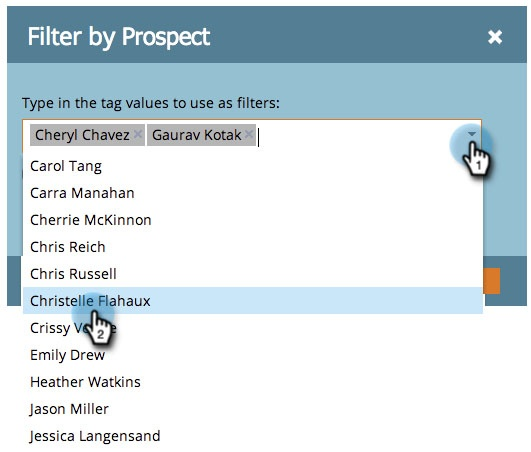

# 태그를 기준으로 프로그램 보고서 필터링 {#filter-a-program-report-by-tag}

프로그램 [성능](create-a-program-performance-report.md)보고 관련 [태그에 집중](http://docs.marketo.com/display/docs/tags).

1. 마케팅 **활동** (또는 **Analytics** )으로 **이동합니다**.

   

1. 프로그램 성능 **보고서를** 선택합니다.

   

1. 설정 **탭을** 클릭하고 **태그** 필터 중 하나를 드래그합니다.

   

1. 보고서에 포함할 태그 값을 선택합니다.

   

1. 적용을 **클릭합니다**.

   

1. 완료! 보고서 **탭** 을 클릭하면 *보고서에서 선택한* 태그와 일치하는 프로그램만 표시됩니다.

   

   >[!NOTE]
   >
   >**관련 문서**
   >
   >    
   >    
   >    * [기간 원가로 프로그램 보고서 필터링](filter-a-program-report-by-period-cost.md)

   >[!NOTE]
   >
   >**딥 다이브**
   >
   >
   >기본 보고의 보고서에 대해 [모두 알아봅니다](http://docs.marketo.com/display/docs/basic+reporting).

