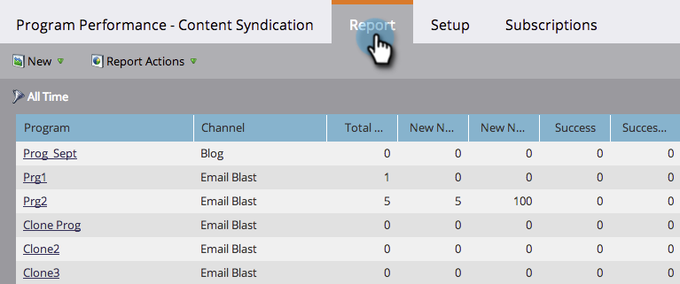

# 태그로 프로그램 보고서 필터링 {#filter-a-program-report-by-tag}

특정 [태그](/help/marketo/product-docs/core-marketo-concepts/programs/working-with-programs/understanding-tags.md){target="_blank"}에 [프로그램 성과 보고서](/help/marketo/product-docs/core-marketo-concepts/programs/program-performance-report/create-a-program-performance-report.md)의 초점을 맞추십시오.

1. **[!UICONTROL 마케팅 활동]**(또는 **[!UICONTROL 분석]**)으로 이동합니다.

   

1. **[!UICONTROL 프로그램 성과]** 보고서를 선택하십시오.

   

1. **[!UICONTROL 설정]** 탭을 클릭하고 **[!UICONTROL 태그]** 필터 중 하나로 끌어서 놓습니다.

   

1. 보고서에 포함할 태그 값을 선택합니다.

   

1. **[!UICONTROL 적용]**&#x200B;을 클릭합니다.

   

1. 완료! **[!UICONTROL 보고서]** 탭을 클릭하면 보고서에서 선택한 태그와 일치하는 _프로그램만_&#x200B;을(를) 볼 수 있습니다.

   

>[!NOTE]
>
>[기간 비용으로 프로그램 보고서 필터링](/help/marketo/product-docs/core-marketo-concepts/programs/program-performance-report/filter-a-program-report-by-period-cost.md){target="_blank"}
