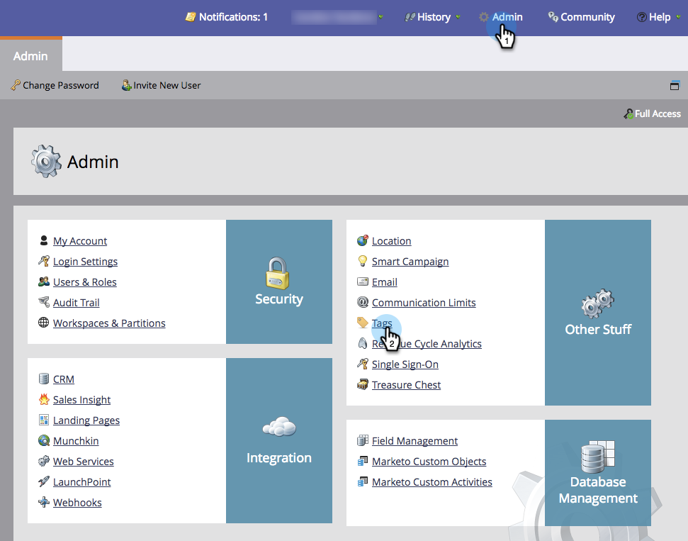

# 사용자 정의 시작 유형 만들기 {#create-custom-entry-types}

프로그램 예약 보기에서 사용할 사용자 정의 시작 유형을 만들 수 있습니다. 이렇게 하면 프로그램에 영향을 미치는 비마케팅 어젠다 항목을 모두 추적할 수 있습니다.

1. 관리 **섹션으로** 이동하고 **태그를 클릭합니다**.

   

1. 달력 **입력 유형을 클릭합니다**.

   

1. 새로 **만들기** 드롭다운을 클릭하고 **응모 유형을 선택합니다**.

   

1. 항목의 이름을 지정하고 아이콘을 선택합니다.

   

1. 응모 **색상을 선택합니다**.

   

1. 저장을 **클릭합니다**.

   

좋아요! 이제 예약 보기에서 새 항목을 만들면 이 유형이 옵션이 됩니다.

>[!NOTE]
>
>최대 100개의 사용자 정의 항목 유형을 만들 수 있습니다.

