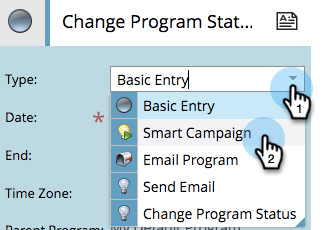
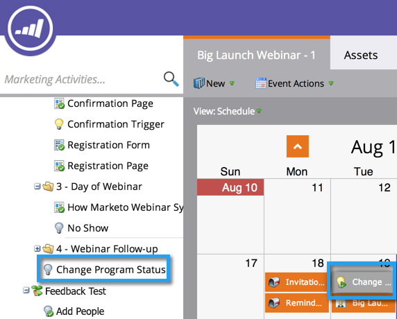

# 프로그램 예약 보기에서 일괄 처리 스마트 캠페인 만들기 {#creating-a-batch-smart-campaign-in-the-program-schedule-view}

프로그램 예약 보기에서 새 스마트 캠페인을 만들고 프로그램 내에서 기존 캠페인을 [다시](rerun-a-smart-campaign-in-the-program-schedule-view.md) 실행할 수 있습니다.

>[!NOTE]
>
>이 보기에서 일괄 스마트 캠페인만 만들 수 있습니다. 트리거 캠페인은 지원되지 않습니다.

1. 새 스마트 캠페인을 실행할 날짜를 선택합니다.

   

1. 새 스마트 캠페인이 될 항목의 이름을 선택합니다. Enter/ **Return** 키를 눌러 이름을 확인합니다.

   

1. 유형 **드롭다운을** 클릭하고 **스마트** ****&#x200B;캠페인을 선택합니다.

   

   >[!NOTE]
   >
   >드롭다운에서 기존 스마트 캠페인을 선택하여 실행할 수도 있습니다.

   

1. 스마트 [캠페인](../../../../product-docs/core-marketo-concepts/smart-campaigns/creating-a-smart-campaign/create-a-new-smart-campaign.md) 규칙을 선택합니다.

   

1. 이제 예약 보기 및 시작 세부 정보에 이 스마트 캠페인이 확인되는 대로 표시됩니다.

   

그러면 프로그램에서 새로운 스마트 캠페인 실행이 만들어집니다.