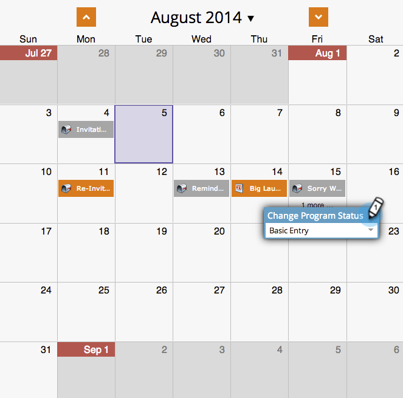
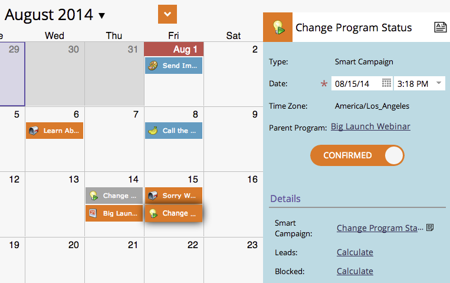

# 프로그램 일정 보기에서 배치 스마트 캠페인 만들기 {#creating-a-batch-smart-campaign-in-the-program-schedule-view}

프로그램 일정 보기에서 프로그램 내에서 새 스마트 캠페인을 만들고 [기존 캠페인을 다시 실행](/help/marketo/product-docs/core-marketo-concepts/programs/program-schedule-view/rerun-a-smart-campaign-in-the-program-schedule-view.md){target="_blank"}할 수 있습니다.

>[!NOTE]
>
>이 보기에서는 배치 캠페인만 만들 수 있습니다. 트리거 캠페인은 지원되지 않습니다.

1. 새 스마트 캠페인을 실행할 날짜를 선택합니다.

   

1. 항목의 이름을 선택하면 새 스마트 캠페인이 됩니다. **[!UICONTROL Enter/Return]** 키를 눌러 이름을 확인합니다.

   

1. **[!UICONTROL Type]** 드롭다운을 클릭하고 **[!UICONTROL Smart Campaign]**&#x200B;을(를) 선택합니다.

   

   >[!NOTE]
   >
   >드롭다운에서 기존 스마트 캠페인을 선택하여 실행할 수도 있습니다.

   

1. [스마트 캠페인](/help/marketo/product-docs/core-marketo-concepts/smart-campaigns/creating-a-smart-campaign/create-a-new-smart-campaign.md){target="_blank"} 규칙을 선택하세요.

   

1. 이제 이 스마트 캠페인이 일정 보기 및 항목 세부 정보에 확인됩니다.

   

이렇게 하면 프로그램에서 새 스마트 캠페인 실행이 만들어집니다.
