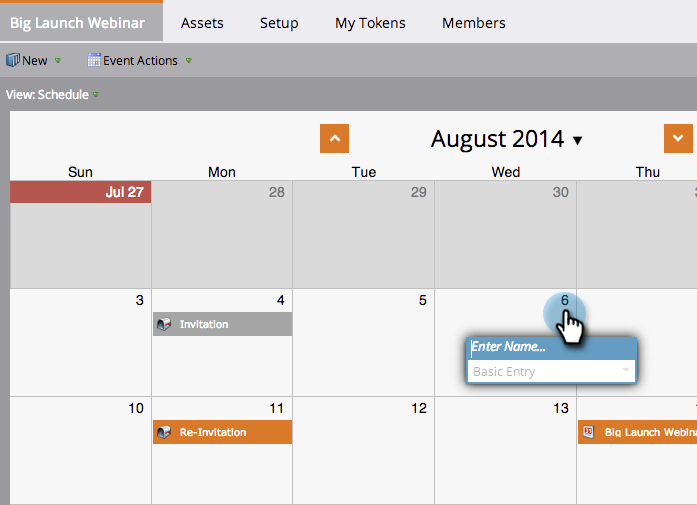
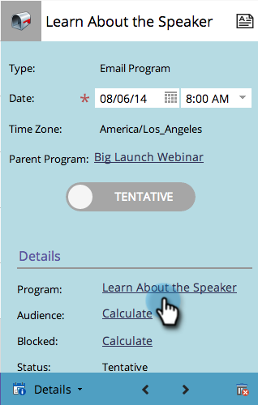

# 일정 보기에서 새 이메일 프로그램 만들기 {#creating-a-new-email-program-in-the-schedule-view}

프로그램 예약 보기 내에서 이메일 프로그램을 빌드할 수 있습니다. 방법은 다음과 같습니다.

1. **[!UICONTROL Marketing Activities]** 으로 이동합니다.

   

1. 프로그램을 선택합니다.

   

1. 전자 메일 프로그램을 실행할 날짜를 선택합니다.

   

1. 이름을 입력합니다. **[!UICONTROL Email Program]**&#x200B;를 선택합니다.

   

1. 항목 세부 정보에서 새 이메일 프로그램에 대한 링크를 클릭합니다.

   

1. [전자 메일 프로그램을 설정](/help/marketo/product-docs/email-marketing/email-programs/creating-an-email-program/create-an-email-program.md){target="_blank"}하고 **[!UICONTROL Approve Program]**&#x200B;을(를) 클릭합니다.

   

   자세한 대시보드 외에도 스마트 캠페인 대신 [전자 메일 프로그램](/help/marketo/product-docs/email-marketing/email-programs/creating-an-email-program/understanding-email-programs.md){target="_blank"}을 사용하면 [A/B 테스트](/help/marketo/product-docs/email-marketing/email-programs/email-program-actions/email-test-a-b-test/add-an-a-b-test.md){target="_blank"}를 쉽게 구현할 수 있다는 이점이 있습니다. 맛있게 드십시오!
