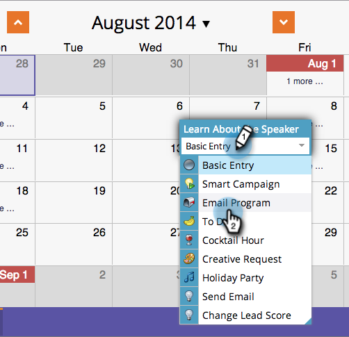

# 예약 보기 {#creating-a-new-email-program-in-the-schedule-view}에서 새 이메일 프로그램 만들기

프로그램 예약 보기 내에서 이메일 프로그램을 만들 수 있습니다. 방법

1. **마케팅 활동**&#x200B;으로 이동합니다.

   

1. 프로그램을 선택합니다.

   

1. 이메일 프로그램을 실행할 날짜를 선택합니다.

   

1. 이름을 입력합니다. **이메일 프로그램**&#x200B;을 선택합니다.

   

1. 항목 세부 정보에서 새 이메일 프로그램에 대한 링크를 클릭합니다.

   

1. [이메일 프로그램을 설정하고 ](/help/marketo/product-docs/email-marketing/email-programs/creating-an-email-program/create-an-email-program.md) 프로그램  **승인을 클릭합니다**.

   

   세부 대시보드 외에도, 스마트 캠페인 대신 [이메일 프로그램](/help/marketo/product-docs/email-marketing/email-programs/creating-an-email-program/understanding-email-programs.md)을 사용하는 경우의 이점은 [A/B 테스트](/help/marketo/product-docs/email-marketing/email-programs/email-program-actions/email-test-a-b-test/add-an-a-b-test.md)를 쉽게 구현할 수 있는 기능입니다. 즐기세요!
