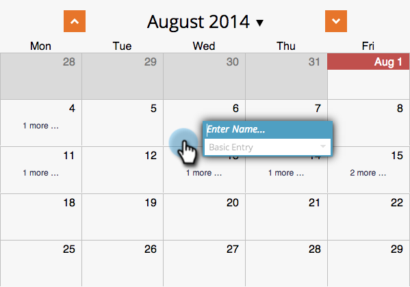
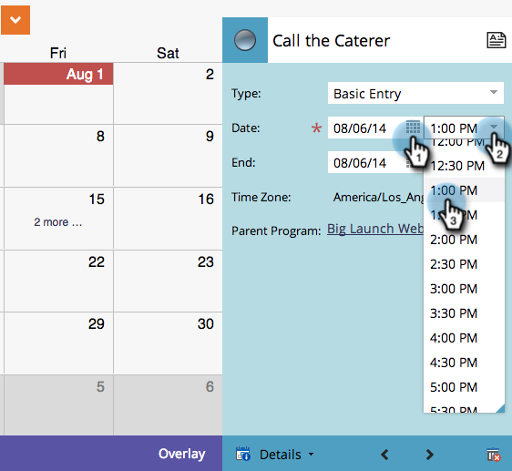

# 프로그램 일정 보기 {#creating-an-entry-in-the-program-schedule-view}에서 항목 만들기

프로그램 스케줄 보기 내에서 항목을 생성하여 기존 프로그램을 보완할 수 있습니다.

## 기본 항목 {#create-a-basic-entry} 만들기

1. **마케팅 활동**&#x200B;으로 이동합니다.

   

1. 프로그램을 선택합니다. **보기** 드롭다운을 클릭합니다. **예약**&#x200B;을 선택합니다.

   

1. 항목을 추가할 날짜를 클릭합니다.

   

1. 항목의 이름을 지정합니다. **Enter**&#x200B;를 눌러 이름을 확인합니다.

   

1. 새 항목의 시작 및 종료 날짜/시간을 선택합니다.

   

1. 추가 정보를 추가하려면 설명 아이콘을 클릭합니다.

   

1. 설명을 입력하고 **저장**&#x200B;을 클릭합니다.

   

1. 항목 설명을 보려면 설명 아이콘 위로 마우스를 가져갑니다.

   

## 항목 유형 변경 {#change-entry-type}

1. **Agenda** 보기에서 기본 항목을 선택합니다.

   

1. **유형** 드롭다운을 선택합니다. 새 입력 유형을 선택합니다.

   >[!NOTE]
   >
   >할 일은 [사용자 지정 항목](/help/marketo/product-docs/core-marketo-concepts/programs/program-schedule-view/create-custom-entry-types.md)입니다. 할 일 및 기타 사용자 지정 항목을 만들어 비마케팅 안건 항목을 추적할 수 있습니다.

   

   멋지다! 변경 사항이 즉시 표시됩니다.

   

>[!NOTE]
>
> 예약 보기에서 [스마트 캠페인](/help/marketo/product-docs/core-marketo-concepts/programs/program-schedule-view/creating-a-batch-smart-campaign-in-the-program-schedule-view.md) 또는 [이메일 프로그램](/help/marketo/product-docs/core-marketo-concepts/programs/program-schedule-view/creating-a-new-email-program-in-the-schedule-view.md)을 만들 수도 있습니다.
