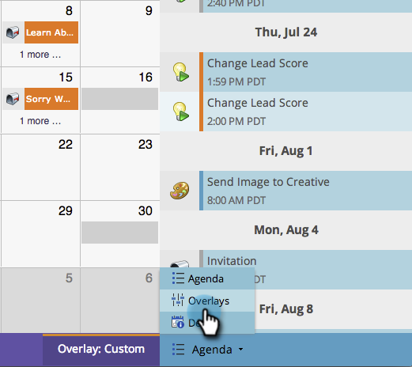

# 프로그램 예약 보기에서 사용자 지정 오버레이 만들기 {#creating-custom-overlays-in-program-schedule-view}

사용자 지정 오버레이를 만들어 요구 사항과 관련된 항목을 볼 수 있습니다.

1. Agenda **드롭다운을** 클릭합니다.

   

1. 오버레이 **를 선택합니다**.

   

1. 오버레이에 표시할 항목 유형을 선택합니다.

   

1. 프로그램 태그로 필터링할 수도 [있습니다](../../../../product-docs/core-marketo-concepts/programs/working-with-programs/understanding-tags/use-tags-in-a-program.md).

   

   멋지네요 이제 오버레이에 정의된 응모만 표시됩니다.

   

