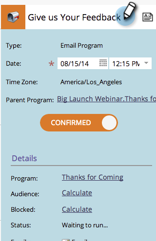

# 프로그램 일정 보기에서 항목 편집 {#editing-entries-in-the-program-schedule-view}

예약 보기에서 프로그램의 여러 요소를 편집할 수 있습니다.

## 항목 이름 편집 {#edit-an-entrys-name}

1. 편집할 항목을 선택합니다.

   

1. 새 이름을 입력하고 키를 누릅니다 **Enter/Return** 키보드에서 변경 내용을 확인합니다.

   

>[!CAUTION]
>
>예약 보기의 표시 이름만 변경합니다. 프로그램의 에셋 이름은 그대로 유지됩니다.

## 항목의 설명 편집 {#edit-an-entrys-description}

1. 설명 아이콘을 클릭합니다.

   

1. 설명을 편집합니다. 클릭 **저장**.

   

1. 잘됐네! 이제 설명이 변경되었습니다.

   

## 게시물 날짜 편집 {#edit-an-entrys-date}

1. 새 날짜를 선택합니다.

   

이 돌덩이! 이제 입력 날짜가 새 날짜로 이동되었습니다.

>[!NOTE]
>
> 이미 실행된 스마트 캠페인 및 이메일 프로그램 항목은 과거로 이동할 수 없습니다.
