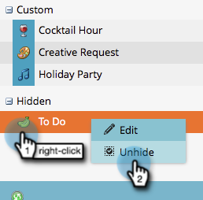

# 사용자 지정 항목 유형 숨기기 및 숨기기 취소 {#hiding-and-unhiding-custom-entry-types}

사용자 지정 항목 유형은 관리 섹션에서 숨길 수 있습니다. 항목 유형을 숨기면 더 이상 옵션으로 표시되지 않습니다.

## 사용자 지정 항목 유형 숨기기 {#hide-a-custom-entry-type}

1. 로 이동 **[!UICONTROL 관리자]** 섹션 및 클릭 **[!UICONTROL 달력 항목 유형]**.

   

1. 사용자 지정 항목을 마우스 오른쪽 단추로 클릭하고 **[!UICONTROL 숨기기]**.

   

   끝내주네 이 항목 유형은 더 이상 사용할 수 없습니다.

## 사용자 지정 항목 유형 숨기기 취소 {#unhide-a-custom-entry-type}

사용자 지정 항목 유형의 숨김을 해제하려면 이 방법도 간단합니다.

1. 항목을 마우스 오른쪽 단추로 클릭하고 를 선택합니다. **[!UICONTROL 숨김 취소]**.

   

   짜잔! 이제 사용자 지정 항목 유형이 숨김 해제되었습니다.

   
