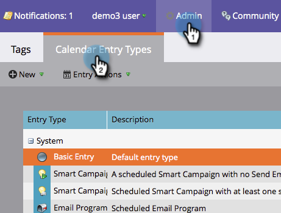

# 사용자 지정 항목 유형 숨기기 및 숨김 취소 {#hiding-and-unhiding-custom-entry-types}

사용자 지정 시작 유형은 관리 섹션에서 숨길 수 있습니다. 숨긴 항목 유형은 더 이상 옵션으로 표시되지 않습니다.

## 사용자 지정 항목 유형 숨기기 {#hide-a-custom-entry-type}

1. 관리 섹션으로 이동하고 **달력** **유형** 항목 **을****클릭합니다**.

   

1. 사용자 정의 항목을 마우스 오른쪽 단추로 클릭하고 **숨기기를 클릭합니다**.

   

   멋지네요 이 입력 유형은 더 이상 사용할 수 없습니다.

## 사용자 지정 항목 유형 숨기기 취소 {#unhide-a-custom-entry-type}

사용자 정의 입력 유형을 숨김 취소하려는 경우에도 간단합니다.

1. 항목을 마우스 오른쪽 단추로 클릭하고 **숨김 해제를 선택합니다**.

   

   짜잔! 이제 사용자 정의 항목 유형이 숨김 해제됩니다.

   

