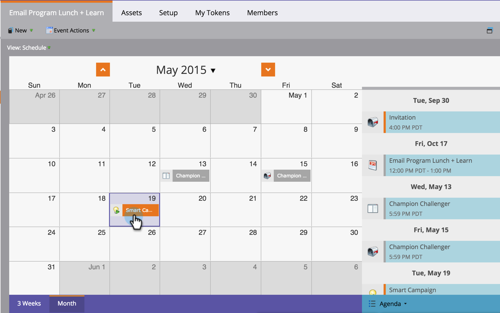

# 프로그램 일정 보기 {#reschedule-a-batch-smart-campaign-in-the-program-schedule-view}에서 일괄 처리 스마트 캠페인 다시 예약

일괄 처리 스마트 캠페인 실행을 다시 예약하시겠습니까? 프로그램 예약 보기에서 나중에 끌어다 놓습니다.

1. 다시 예약할 스마트 캠페인을 선택합니다.

   

1. 캠페인을 실행할 새 날짜로 드래그하여 놓습니다.

1. 좋아요! 스마트 캠페인이 다시 예약되었습니다. 시작 세부 정보에 있는 **날짜** 드롭다운에서 시간을 변경할 수도 있습니다.

   

>[!MORELIKETHIS]
>
>[스케줄 뷰에서 전체 프로그램 스케줄 조정](/help/marketo/product-docs/core-marketo-concepts/programs/program-schedule-view/rescheduling-an-entire-program-from-the-schedule-view.md)
