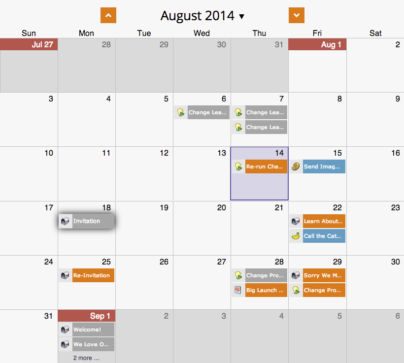

# 스케줄 보기 {#rescheduling-an-entire-program-from-the-schedule-view}에서 전체 프로그램 스케줄 조정

날짜와 함께 프로그램 또는 이벤트를 복제할 때 모든 날짜를 한 번에 다시 예약해야 할 수 있습니다. 방법

1. 다시 예약할 프로그램을 선택합니다.

   

1. 이벤트 작업 드롭다운을 선택합니다. 항목 스케줄 조정을 선택합니다.

   

1. 앵커 항목을 선택합니다. 이러한 움직임에 따라 다른 모든 항목이 함께 이동합니다.

   

1. 새 시작 날짜를 선택합니다.

   

1. 다시 예약을 클릭합니다.

   

1. 우프! 그러면 Adobe 데이터 검색자가 올바른 날짜로 모든 자산을 승인하지 않고, 다시 예약하고, 다시 승인합니다!

   

>[!NOTE]
>
>이미 실행된 자산은 이동하지 않습니다.

미친놈! 이제 모든 일정이 다시 조정되었습니다. 필요에 따라 특정 날짜를 조정합니다.    

