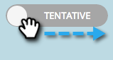

# 미정/확정 날짜 이해 {#understanding-tentative-confirmed-dates}

스마트 캠페인 및 이메일 프로그램에는 다음과 같이 표시할 수 있는 강력한 기능이 있습니다 **임시** 또는 **확인됨**. 작동하는 방식은 다음과 같습니다.

## 임시 {#tentative}

임시 날짜가 의도를 전달합니다. 이것을 다음과 같이 생각해 보십시오 _연필로_ 달력에 있는 어떤 것입니다. 임시 항목은 실행되지 않습니다. 자리 표시자만 사용됩니다.

>[!NOTE]
>
>일괄 처리 스마트 캠페인 및 이메일 프로그램만 일시적으로 지정할 수 있습니다.

## 항목 확인 {#confirming-entries}

이는 자산을 승인하는 것과 동일하므로 확인하기 전에 항목을 완전히 설정해야 합니다. 모든 오리가 한 행에 있으면 임시 탭을 오른쪽으로 슬라이딩하여 항목을 확인할 수 있습니다.

>[!NOTE]
>
>왜 그 개죠? 그는 리트리버예요 그는 너의 데이터를 가져오고 있다.

## 확인됨 {#confirmed}

확인된 항목이 반드시 실행됩니다. 규칙도 있고, 승인된 자산도 있으며, 확정된 날짜와 시간도 있습니다.

## 완료됨  {#finished}

완료된 항목이 이미 실행되었습니다. 과거에만(명백히) 있을 수 있습니다. 항목이 실행되면 및 가 **완료됨**, 이동하거나 임시 상태로 만들 수 없습니다. (현실을 바꾸지 않고, 시간 흐름의 연속을 방해하지 않음)

이러한 상태는 강력한 툴입니다. 프로그램을 복제하면 모든 스마트 캠페인 및 이메일 프로그램 날짜가 임시 상태가 됩니다. 예약 보기에서 바로 확인할 수 있습니다. 멋지죠?
