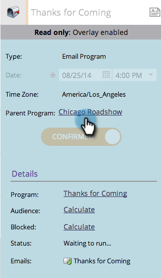
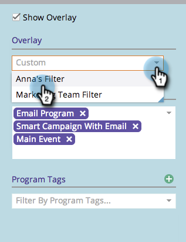

# 전역 오버레이 사용 {#using-a-global-overlay}

프로그램 예약 보기의 글로벌 오버레이를 사용하면 다른 예약된 자산과 관련하여 프로그램을 볼 수 있습니다.

>[!PREREQUISITES]
>
>이 기능을 사용하려면 [마케팅 달력 라이선스](../../../../product-docs/core-marketo-concepts/marketing-calendar/understanding-the-calendar/issue-revoke-a-marketing-calendar-license.md)가 있어야 합니다.

## 전역 오버레이 사용 {#use-the-global-overlay}

1. 프로그램을 선택합니다.

   

1. 오른쪽 아래 모서리에서 **오버레이**&#x200B;를 선택합니다.

   

1. 단색 블록은 해당 날짜의 항목을 나타냅니다. 세부 사항을 보려면 을 클릭합니다.

   

   오버레이 항목에 대한 항목 세부 사항은 읽기 전용입니다. 상위 프로그램을 클릭하여 변경합니다.

   

## 저장된 필터를 오버레이로 사용 {#use-a-saved-filter-as-an-overlay}

[마케팅 달력](../../../../product-docs/core-marketo-concepts/marketing-calendar/working-with-the-calendar/saving-a-filter-definition-in-the-marketing-calendar.md)에 필터를 저장한 경우 프로그램 일정 보기에서 오버레이로 사용할 수 있습니다.

1. **오버레이** 드롭다운을 클릭하고 필터 정의를 선택합니다.

   

   너무 쉬워! 이제 저장 및 선택한 필터에 의해 정의된 오버레이가 표시됩니다.

   

   >[!NOTE]
   >
   >**관련 문서**
   >
   >    
   >    
   >    * [프로그램 예약 보기에서 사용자 지정 오버레이 만들기](creating-custom-overlays-in-program-schedule-view.md)

