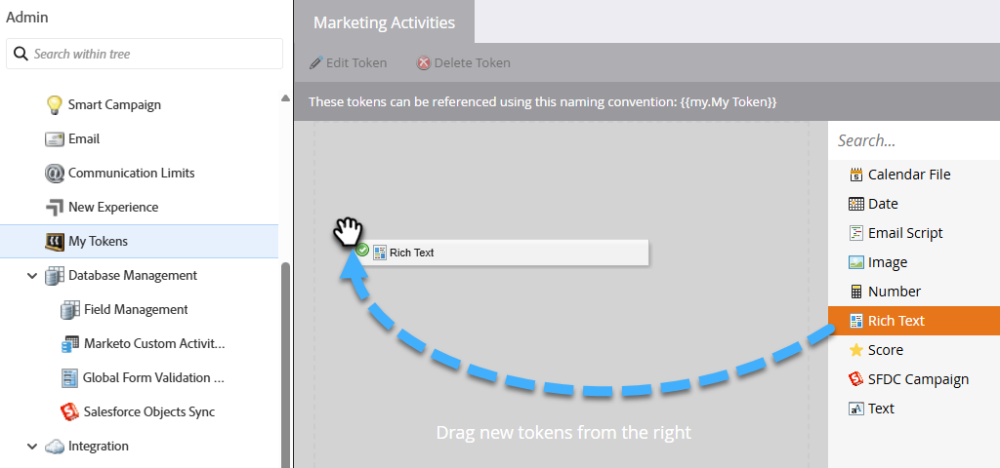

# 내 토큰 관리 {#managing-my-tokens}

토큰을 사용하면 Marketo Engage에서의 작업을 단순화할 수 있습니다. 흐름 단계, 웹후크, 이메일 및 랜딩 페이지에서 [내 토큰](/help/marketo/product-docs/core-marketo-concepts/programs/tokens/understanding-my-tokens-in-a-program.md){target="_blank"}(사용자 지정 토큰)을 사용할 수 있습니다. 만드는 방법은 다음과 같습니다.

>[!TIP]
>
>[토큰 개요](/help/marketo/product-docs/demand-generation/landing-pages/personalizing-landing-pages/tokens-overview.md){target="_blank"}에서 사용 가능한 토큰에 대해 자세히 알아보세요.

## 로컬 또는 글로벌 내 토큰 만들기 {#create-a-my-token}

>[!BEGINTABS]

>[!TAB 로컬 내 토큰]

1. **[!UICONTROL Marketing Activities]**&#x200B;에서 원하는 프로그램 또는 캠페인 폴더를 선택하고 **[!UICONTROL My Tokens]** 탭을 클릭합니다.

   

1. 원하는 내 토큰을 캔버스로 드래그합니다.

   

1. 고유한 이름을 입력하고 관련 값을 입력합니다.

   

1. **[!UICONTROL Save]**&#x200B;을(를) 클릭합니다.

   

>[!TAB 전역 내 토큰]

>[!NOTE]
>
>관리자 권한이 필요합니다.

1. **[!UICONTROL Admin]** 영역으로 이동하여 **[!UICONTROL My Tokens]**&#x200B;을(를) 선택합니다.

   

1. 원하는 내 토큰을 캔버스로 드래그합니다.

   

1. 고유한 이름을 입력하고 관련 값을 입력합니다.

   

1. **[!UICONTROL Save]**&#x200B;을(를) 클릭합니다.

   

>[!ENDTABS]

## 내 토큰 편집 {#edit-a-my-token}

1. 편집할 토큰을 선택하고 **[!UICONTROL Edit Token]**&#x200B;을(를) 클릭합니다.

   

1. 원하는 대로 편집합니다. 완료되면 **[!UICONTROL Save]**&#x200B;을(를) 클릭합니다.

   

## 내 토큰 삭제 {#delete-a-my-token}

>[!CAUTION]
>
>내 토큰을 삭제할 때 현재 어떤 에셋에서도 참조되지 않는지 확인하십시오. 삭제될 경우 참조되는 모든 위치에 빈 공간이 표시됩니다.

1. 삭제할 토큰을 선택하고 **[!UICONTROL Delete Token]**&#x200B;을(를) 클릭합니다.

   

1. **[!UICONTROL Delete]**&#x200B;을(를) 클릭합니다.

   

   >[!MORELIKETHIS]
   >
   >* [토큰 개요](/help/marketo/product-docs/demand-generation/landing-pages/personalizing-landing-pages/tokens-overview.md){target="_blank"}
   >* [프로그램의 내 토큰 이해](/help/marketo/product-docs/core-marketo-concepts/programs/tokens/understanding-my-tokens-in-a-program.md){target="_blank"}
   >* [내 토큰에 URL 사용](/help/marketo/product-docs/email-marketing/general/using-tokens/using-urls-in-my-tokens.md){target="_blank"}
