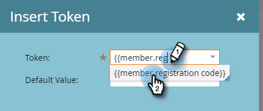

# 프로그램 멤버 사용자 정의 필드 토큰 {#program-member-custom-field-tokens}

## 프로그램 멤버 사용자 정의 필드에 대한 토큰 지원 {#token-support-for-program-member-custom-fields}

프로그램 멤버 사용자 정의 필드 기능 뒷면에서 토큰 프레임워크의 프로그램 멤버 사용자 정의 필드에 대한 지원이 확장되고 있습니다.

PMCF 토큰은 토큰 계열의 멤버 도메인에서 지원됩니다.

멤버 토큰은 프로그램 멤버의 범위에 있는 필드에 사용됩니다. 현재 상태에서는 멤버 토큰을 사용하여 통합 서비스 파트너의 고유 값을 삽입할 수도 있습니다. `{{member.webinar url}}` 토큰은 서비스 공급자가 생성한 개인의 고유 확인 URL을 자동으로 확인합니다. {{member.registration code}} 서비스 공급자가 제공한 등록 코드로 확인됩니다.

>[!NOTE]
>
>* 프로그램 멤버 사용자 정의 필드는 프로그램 컨텍스트에서만 사용할 수 있습니다.
>* 이메일 프리헤더, 대기 단계의 날짜 토큰 또는 코드 조각에서 프로그램 멤버 사용자 정의 필드 토큰을 사용할 수 없습니다.
>* 프로그램 멤버 상태는 멤버 토큰에서 지원되지 않습니다.

## 에셋에서 프로그램 멤버 사용자 정의 필드 토큰 사용 {#using-program-member-custom-field-tokens-in-assets}

프로그램 멤버 사용자 정의 필드 토큰을 이메일, 랜딩 페이지, SMS, 푸시 알림 및 웹후크에 삽입할 수 있습니다.

**이메일**

1. 원하는 이메일을 선택하고 **[!UICONTROL 초안 편집]**.

   

1. 토큰 삽입 아이콘을 클릭합니다.

   

1. 원하는 프로그램 멤버 사용자 정의 필드 토큰을 찾아 선택하고 기본값을 입력한 다음 **[!UICONTROL 삽입]**.

   

1. **[!UICONTROL 저장]**&#x200B;을 클릭합니다.

   

>[!NOTE]
>
>이메일 승인 잊지 마세요.

**랜딩 페이지**

1. 랜딩 페이지를 선택하고 **[!UICONTROL 초안 편집]**.

   

   >[!NOTE]
   >
   >랜딩 페이지 디자이너가 새 창에 열립니다.

1. 토큰을 추가할 서식 있는 텍스트 상자를 두 번 클릭합니다.

   

1. 토큰을 삽입할 위치를 클릭한 다음, 토큰 삽입 아이콘을 클릭합니다.

   

1. 원하는 토큰을 찾아 선택합니다.

   

1. 기본값을 입력하고 **[!UICONTROL 삽입]**.

   

1. **[!UICONTROL 저장]**&#x200B;을 클릭합니다.

   

**SMS**

1. 원하는 SMS를 선택하고 **[!UICONTROL 초안 편집]**.

   

1. 다음을 클릭합니다. **`{{ Token`** 단추를 클릭합니다.

   

1. 원하는 프로그램 멤버 사용자 정의 필드 토큰을 찾아 선택합니다. 기본값을 입력하고 삽입을 클릭합니다.

   

1. SMS 작업 드롭다운을 클릭하고 을 선택합니다. **[!UICONTROL 승인 및 닫기]**.

   

**푸시 알림**

1. 원하는 푸시 알림을 선택하고 **[!UICONTROL 초안 편집]**.

   

1. 클릭 **[!UICONTROL 푸시 알림]**.

   

1. 편집기에서 메시지를 클릭하고 `{{` 토큰 선택기를 가져오는 단추.

   

1. 원하는 프로그램 멤버 사용자 정의 필드 토큰을 찾아 선택합니다. 기본값을 입력하고 **[!UICONTROL 삽입]**.

   

1. 클릭 **[!UICONTROL 완료]** 저장 및 종료하기(또는 **[!UICONTROL 다음]** 을 참조하십시오.

   

>[!NOTE]
>
>프로그램 구성원에 대한 프로그램 구성원 사용자 정의 필드에 값이 없는 경우 토큰이 제공된 경우 기본값으로 대체됩니다.

## 캠페인에서 프로그램 멤버 사용자 정의 필드 토큰 사용 {#using-program-member-custom-field-tokens-in-campaigns}

프로그램 멤버 사용자 정의 필드 토큰은에서 사용할 수 있습니다.

* 작업 만들기
* Microsoft에서 작업 만들기
* 즐거운 순간
* 데이터 값 흐름 작업 변경
* 웹훅
