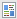

# 프로그램의 토큰 이해 {#understanding-my-tokens-in-a-program}

토큰은 이메일, 랜딩 페이지 및 스마트 캠페인에 사용할 수 있는 변수입니다.

내 토큰 외에도 프로그램에 내장된 토큰을 사용할 수도 있습니다. 토큰 [개요를 확인합니다](/help/marketo/product-docs/demand-generation/landing-pages/personalizing-landing-pages/tokens-overview.md).

## 내 토큰  {#my-tokens}

내 토큰은 누구나 만들 수 있는 사용자 지정 변수입니다. 캠페인 폴더 또는 [프로그램에서 만들어집니다](/help/marketo/product-docs/core-marketo-concepts/programs/tokens/managing-my-tokens.md) .

내 토큰은 다음과 같이 표시됩니다. `{{my.Name Of Token}}`

예:

* `{{my.Event Date}}`
* `{{my.Webinar Speaker}}`

<table> 
 <thead> 
  <tr> 
   <th>토큰 유형</th> 
   <th>설명</th> 
  </tr> 
 </thead> 
 <tbody> 
  <tr> 
   <td>달력 파일 </td> 
   <td>이 토큰을 사용하여 달력 이벤트 파일(. <a href="../../../../product-docs/email-marketing/general/functions-in-the-editor/create-a-calendar-event-ics-file.md">ics)</a><a href="../../../../product-docs/email-marketing/general/functions-in-the-editor/create-a-calendar-event-ics-file.md">을 이메일 및 랜딩 페이지에</a> 추가합니다.</td> 
  </tr> 
  <tr> 
   <td>
날짜 
</td> 
   <td>이 토큰은 날짜 값을 보유합니다. 날짜는 연 요일(예: 2016-05-23)로 표시됩니다.</td> 
  </tr> 
  <tr> 
   <td>이메일 스크립트 </td> 
   <td>이 토큰을 사용하여 이메일에서 Velocity 스크립트를 실행합니다. 자세한 <a href="http://developers.marketo.com/documentation/email-scripting/" title="팔로우 링크" rel="nofollow">내용</a>. </td> 
  </tr> 
  <tr> 
   <td>숫자 </td> 
   <td>모든 정수 부정적일 수도 있습니다.</td> 
  </tr> 
  <tr> 
   <td>리치 텍스트 </td> 
   <td>HTML입니다. 이메일 및 랜딩 페이지에서 사용합니다.</td> 
  </tr> 
  <tr> 
   <td>점수 </td> 
   <td>점수 <a href="../../../../product-docs/core-marketo-concepts/smart-campaigns/flow-actions/use-tokens-in-flow-steps.md">흐름 변경 단계에서 이 토큰을 사용하십시오</a>. </td> 
  </tr> 
  <tr> 
   <td colspan="1">SFDC 캠페인 </td> 
   <td colspan="1">이 토큰을 사용하여 마케팅 프로그램의 일부로 되는 리드를 SFDC 캠페인이 추가되는 모든 리드에 추가할 수 있습니다.</td> 
  </tr> 
  <tr> 
   <td>텍스트 </td> 
   <td>텍스트만 HTML이 넘치는 경우 사용합니다. 텍스트 토큰의 크기 제한은 524,288자(UTF-8) 또는 2MB입니다.</td> 
  </tr> 
 </tbody> 
</table>

>[!CAUTION]
>
>Microsoft Dynamics 또는 Salesforce의 Sales Insight에서 이메일을 보낼 때 내 토큰은 확인되지 않습니다.표준 토큰만 채워집니다(리드, 회사 등). 그러나 토큰의 기본값 *은* 작동합니다.

## 토큰 중첩 {#nesting-tokens}

새 토큰을 만들면 트리의 다른 개체에서 참조할 수 있습니다. 편리한 관리를 위해 토큰을 만든 곳에 이름 지정 구조가 있습니다.

* **로컬 토큰:** 해당 프로그램 또는 폴더에 토큰이 만들어졌습니다.
* **상속된 토큰:** 토큰이 트리 위로 더 높은 수준의 프로그램 또는 폴더 어딘가에 만들어졌습니다.
* **재정의된 토큰:** 토큰이 상속된 후 이 프로그램 또는 폴더에서 예외가 발생했습니다.

전역 변수를 만든 다음 트리 하위 수준에서 재정의할 수 있습니다.

프로그램 및 폴더 이동은 토큰에도 영향을 줍니다. 이동 중에 참조가 손상되지 않았는지 항상 확인합니다.

>[!NOTE]
>
>참여 프로그램에서 보내는 이메일이 기본 프로그램(참여 프로그램 로컬 이메일 아님)의 하위 이메일인 경우, 이메일에 사용된 내 토큰은 하위 이메일이 있는 기본 프로그램에서 해결됩니다.

>[!MORELIKETHIS]
>
>* [토큰 개요](/help/marketo/product-docs/demand-generation/landing-pages/personalizing-landing-pages/tokens-overview.md)
>* [내 토큰 관리](/help/marketo/product-docs/core-marketo-concepts/programs/tokens/managing-my-tokens.md)

