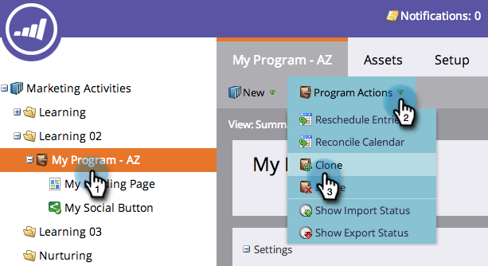

# 프로그램 복제 {#clone-a-program}

모든 것을 수동으로 다시 구성하는 대신 전체 프로그램과 모든 에셋을 빠르고 손쉽게 복제할 수 있습니다. 방법

1. 복제할 프로그램을 찾아 선택한 다음 **프로그램 작업** 아래에서 **복제를 클릭합니다.**

   

1. 프로그램을 복제할 위치를 선택합니다.

   >[!NOTE]
   >
   >프로그램은 [캠페인](../../../../product-docs/core-marketo-concepts/miscellaneous/create-new-campaign-folder.md) [폴더](../../../../product-docs/core-marketo-concepts/miscellaneous/create-new-campaign-folder.md) 또는 [작업 영역](../../../../product-docs/administration/workspaces-and-person-partitions/create-a-new-workspace.md)에 복제할 수 있습니다. 모든 기본 종속 자산(이메일, 코드 단편, 랜딩 페이지 템플릿 등)을 공유해야 합니다. 를 복제하기 전에 대상 작업 영역으로 전환합니다.

   

   >[!NOTE]
   >
   >**설명**
   >
   >
   >위 스크린샷에 나와 있는 메모를 참조하십시오. 즉, 목록에 1,000명 이상의 사람을 포함하는 프로그램을 복제하면 목록 자체가 복제되지만 빈 상태가 됩니다. 999명 이하의 사용자가 포함된 목록으로 프로그램을 복제하면 해당 목록이 모든 구성원과 함께 복제된 프로그램에 표시됩니다.

   이름을 입력합니다.

   

   프로그램을 복제할 폴더를 선택합니다.
   

1. 선택적 설명을 추가한 다음 **만들기**&#x200B;를 클릭합니다. 모든 에셋을 사용할 수 있는 새로운 프로그램을 얼마나 신속하게 제작할 수 있었는지 살펴보십시오.

   

   >[!TIP]
   >
   >이 기술을 [토큰](http://docs.marketo.com/display/docs/using+tokens)과 함께 사용하여 새 프로그램을 빠르게 만듭니다.

   >[!CAUTION]
   >
   >기간 비용은 전달되지 않으므로 원래 애플리케이션에 설정된 값이 있는 경우 복제한 프로그램에 추가해야 합니다.

