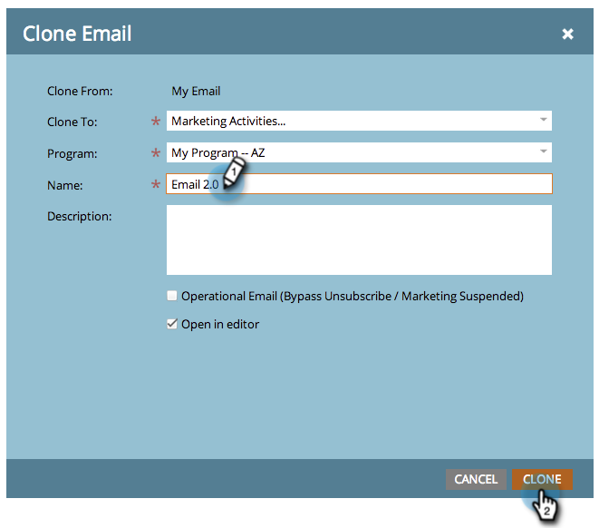

# 프로그램에서 에셋 복제 {#clone-an-asset-in-a-program}

프로그램을 복제하면 _모든 항목_&#x200B;이 복제됩니다. 때로는 에셋 하나를 복제하려고 할 때도 있습니다. 방법은 다음과 같습니다.

>[!NOTE]
>
>[랜딩 페이지 테스트 그룹을 복제](/help/marketo/product-docs/demand-generation/landing-pages/landing-page-actions/cloning-a-landing-page-test-group.md){target="_blank"}하려면 추가 단계를 수행해야 합니다.

## 로컬 자산 복제 {#clone-a-local-asset}

1. **[!UICONTROL 마케팅 활동]**(으)로 이동합니다.

   

1. 프로그램을 선택합니다.

   

1. 복제할 로컬 자산을 마우스 오른쪽 버튼으로 클릭합니다. **[!UICONTROL 복제]**&#x200B;를 클릭합니다.

   

1. 에셋의 종류마다 다른 대화 상자가 표시됩니다. 정보를 입력하고 **[!UICONTROL 복제]**&#x200B;를 클릭하세요.

   

   >[!TIP]
   >
   >에셋을 다른 프로그램에 복제할 수도 있습니다. **[!UICONTROL 프로그램]** 드롭다운을 사용하여 선택하십시오.

1. 잘됐네! 이제 복제된 새 자산이 표시됩니다.

   

   >[!NOTE]
   >
   >[프로그램 복제](/help/marketo/product-docs/core-marketo-concepts/programs/working-with-programs/clone-a-program.md){target="_blank"}
