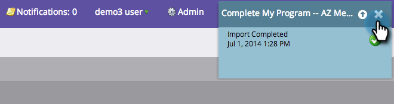

# 스프레드시트에서 프로그램으로 구성원 가져오기 {#import-members-from-a-spreadsheet-into-a-program}

프로그램의 구성원이 자동으로 되는 사람 목록을 가져올 수 있습니다. 할 일이 있습니다.

## CSV 파일 준비 {#prepare-your-csv-file}

1. 아래 예제와 같이 [!DNL Excel]에 표준 CSV 파일을 만듭니다.

   

   >[!CAUTION]
   >
   >날짜를 날짜 필드로 가져올 때 다음 형식을 사용하십시오. 9/29/24 (월/일/년).

## CSV를 Marketo으로 가져오기 {#import-your-csv-into-marketo}

1. 프로그램에서 **[!UICONTROL Members]** 섹션으로 이동합니다.

   

1. **[!UICONTROL Import Members]**&#x200B;을(를) 클릭합니다.

   

1. CSV를 선택하고 **[!UICONTROL Next]**&#x200B;을(를) 클릭합니다.

   

1. 목록의 데이터 값을 해당 Marketo 필드에 매핑하고 **[!UICONTROL Next]**&#x200B;을(를) 클릭합니다.

   

   >[!NOTE]
   >
   >가져오지 않을 필드가 있으면 Marketo 필드 드롭다운 메뉴에서 **[!UICONTROL IGNORE]**&#x200B;을(를) 선택하십시오.

1. 목록의 **[!UICONTROL Member Status]**&#x200B;을(를) 선택하십시오.

   

1. **[!UICONTROL Import]**&#x200B;을(를) 클릭합니다.

   

1. Marketo 가져오기가 완료될 때까지 기다린 다음 확인 대화 상자를 닫습니다.

   

   잘됐네! 가져온 새 구성원이 표시됩니다.

   

>[!MORELIKETHIS]
>
>[구성원 관리 및 보기](/help/marketo/product-docs/core-marketo-concepts/programs/working-with-programs/manage-and-view-members.md){target="_blank"}
