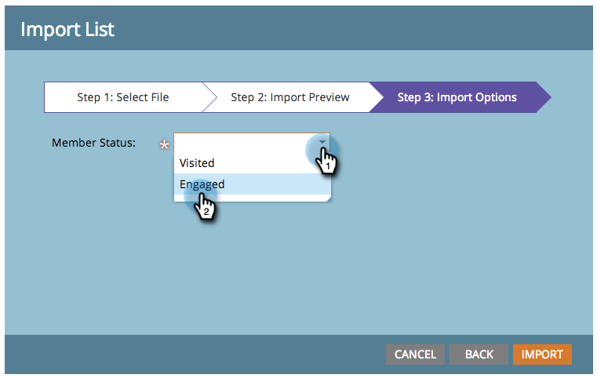

# 스프레드시트에서 프로그램으로 멤버 가져오기 {#import-members-from-a-spreadsheet-into-a-program}

자동으로 프로그램의 구성원이 되는 사람 목록을 가져올 수 있습니다. 어떻게 해야 할지 알려드리겠습니다.

## CSV 파일 준비 {#prepare-your-csv-file}

1. 아래 예와 같이 Excel에서 표준 CSV 파일을 만듭니다.

   

   >[!CAUTION]
   >
   >날짜를 날짜 필드로 가져올 때 다음 형식을 사용하십시오. 9/29/13(월/일/년).

## Marketo으로 CSV 가져오기 {#import-your-csv-into-marketo}

1. 프로그램에서 **멤버** 섹션을 참조하십시오.

   

1. 클릭 **멤버 가져오기**.

   

1. CSV를 선택하고 를 클릭합니다 **다음**.

   

1. 목록의 데이터 값을 해당 Marketo 필드에 매핑하고 **다음**.

   

   >[!NOTE]
   >
   >가져오지 않을 필드가 있으면 을(를) 선택합니다. **무시** Marketo 필드 드롭다운 메뉴에서 을 클릭합니다.

1. 을(를) 선택합니다 **멤버 상태** 참조하십시오.

   

1. 클릭 **가져오기**.

   

1. Marketo이 가져오기를 완료할 때까지 기다렸다가 확인 대화 상자를 닫습니다.

   

   좋아요! 가져온 새 구성원이 표시됩니다.

   

>[!MORELIKETHIS]
>
>[구성원 관리 및 보기](/help/marketo/product-docs/core-marketo-concepts/programs/working-with-programs/manage-and-view-members.md)
