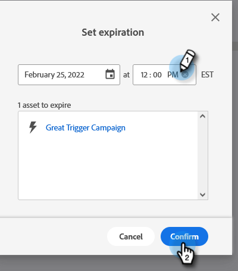

# 로컬 자산 만료 {#local-asset-expiration}

만료 날짜/시간을 설정하여 랜딩 페이지 게시를 취소하거나, 트리거 캠페인을 비활성화하거나, 반복 배치 캠페인을 중지합니다.

## 예약 자산 만료 권한 부여 {#grant-schedule-asset-expiration-permission}

에셋 만료를 예약하려면 먼저 Marketo 역할에 적절한 권한이 활성화되어 있어야 합니다.

>[!NOTE]
>
>**관리자 권한 필요**

1. 다음에서 [!UICONTROL 관리자] 영역, 클릭 **[!UICONTROL 사용자 및 역할]**.

   

1. 다음을 클릭합니다. **[!UICONTROL 역할]** 탭에서 액세스 권한을 부여할 사용자를 선택한 다음 **[!UICONTROL 역할 편집]**.

   

1. 아래 [!UICONTROL 마케팅 활동 액세스], 선택 **[!UICONTROL 로컬 자산 만료 예약]** 및 클릭 **[!UICONTROL 저장]**.

   

## 만료 날짜 설정 {#set-an-expiration-date}

1. 원하는 프로그램을 마우스 오른쪽 단추로 클릭하고 를 선택합니다. **[!UICONTROL 로컬 자산 만료 설정]**.

   

1. 만료 날짜를 설정하려는 자산을 선택한 다음 을 클릭합니다. **[!UICONTROL 만료 설정]**.

   

1. 만료 날짜를 선택합니다.

   

1. 시간을 설정합니다. 미래 시간으로 최소 15분 시간을 예약해야 합니다(오전/오후 입장 잊지 마십시오). 클릭 **[!UICONTROL 확인]** 완료 시.

   

>[!NOTE]
>
>* 기존 만료 날짜를 편집하려면 자산을 확인하고 을(를) 클릭하십시오. **[!UICONTROL 만료 설정]**.
>* 자산이 만료되면 만료 그리드에 더 이상 표시되지 않습니다. 그리드에는 게시된 랜딩 페이지, 활성 트리거 캠페인 및 반복 배치 캠페인만 표시됩니다.
>* 자산이 다른 프로그램으로 이동되면 예약된 만료가 제거됩니다.

## 만료 날짜 제거 {#remove-an-expiration-date}

1. 만료 날짜를 제거하려면 자산을 확인하고 을 클릭합니다. **[!UICONTROL 만료 제거]**.

   

1. 영향을 받는 에셋을 검토하고 **[!UICONTROL 확인]**.

   

>[!NOTE]
>
>15분 미만의 만료 날짜는 제거할 수 없습니다. 만료를 &quot;제거&quot;하려면 에셋이 만료될 때까지 기다렸다가 다시 승인하거나 다시 활성화해야 합니다.
