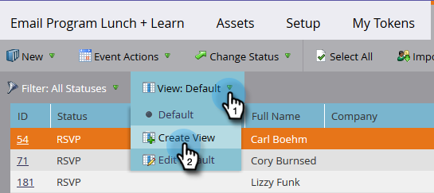

# 구성원 관리 및 보기 {#manage-and-view-members}

멤버 탭을 사용하여 프로그램에서 구성원을 관리하고 볼 수 있습니다.

>[!NOTE]
>
>**자세히 알아보기**
>
> 프로그램 [멤버십에 대한 자세한 내용을 살펴보십시오](../../../../product-docs/core-marketo-concepts/programs/creating-programs/understanding-program-membership.md).

## 구성원 검색 {#search-for-a-member}

구성원 섹션 하단에서 검색 필드를 사용하여 이름, 이메일, 직책 또는 회사별로 프로그램 구성원을 검색합니다.

1. 프로그램의 **멤버** 탭을 클릭합니다.

   

1. 구성원 목록을 검색하려면 검색 필드를 사용합니다.

   

## 멤버 격자 내보내기 {#export-the-members-grid}

검색 필드 옆에 있는 Excel 아이콘을 클릭하여 구성원 목록을 내보낼 수 있습니다.

## 멤버 그리드의 열 관리 {#manage-columns-in-the-members-grid}

* 열을 드래그하여 놓아 순서를 변경할 수 있습니다. 파란색 화살표 쌍은 열이 이동할 위치를 나타냅니다.

   

* 열 헤더를 마우스 오른쪽 단추로 클릭하여 알파벳순으로 오름차순 또는 내림차순으로 정렬합니다.

   

## 격자에 표시할 열 선택 {#choose-which-columns-are-visible-in-the-grid}

1. **View **드롭다운을 클릭하고 보기 **만들기를 선택합니다**.

   

1. 사용자 정의 보기의 이름을 지정합니다. 열 제목을 선택합니다. 추가 **및** 제거**를 클릭하여 열을 이동하고 보기를 만듭니다.

   

1. 만들기를 **클릭합니다**.

   

## 멤버 격자 필터링  {#filter-the-members-grid}

1. 필터 **드롭다운을** 클릭하고 정렬할 승급 단계를 선택합니다.

   

## 멤버 그리드에서 개인 상태 관리 {#manage-person-status-in-the-members-grid}

멤버 격자 내의 사람 상태를 변경할 수 있습니다.

1. Ctrl/ **Cmd를** 누른 채 사람을 선택합니다.

   

1. 상태 **변경** 드롭다운을 클릭하고 상태를 선택합니다.

   

   잠시 시간이 걸릴 수 있습니다. 완료되면 아래 메시지를 볼 수 있습니다.

   

많은 기능이 있지만 매우 간단합니다. 즐기세요!

>[!MORELIKETHIS]
>
>* [프로그램 성능 보고서 만들기](../../../../product-docs/core-marketo-concepts/programs/program-performance-report/create-a-program-performance-report.md)

>

