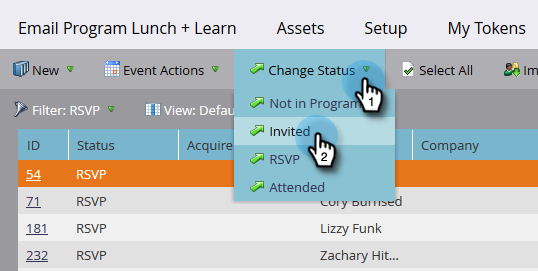

# 구성원 관리 및 보기 {#manage-and-view-members}

멤버 탭을 사용하여 프로그램에서 멤버를 관리하고 볼 수 있습니다.

>[!NOTE]
>
>자세히 알아보기 [프로그램 멤버십](/help/marketo/product-docs/core-marketo-concepts/programs/creating-programs/understanding-program-membership.md){target="_blank"}.

## 구성원 검색 {#search-for-a-member}

멤버 섹션 하단에서 검색 필드를 사용하여 이름, 이메일, 직함 또는 회사별로 프로그램 멤버를 검색합니다.

1. 다음을 클릭합니다. **[!UICONTROL 구성원]** 프로그램 탭

   

1. 검색 필드를 사용하여 구성원 목록을 검색합니다.

   

## 멤버 그리드 내보내기 {#export-the-members-grid}

검색 필드 옆에 있는 Excel 아이콘을 클릭하여 구성원 목록을 내보낼 수 있습니다.

## 멤버 그리드의 열 관리 {#manage-columns-in-the-members-grid}

열을 드래그 앤 드롭하여 순서를 변경합니다. 파란색 화살표 쌍은 열이 이동할 위치를 나타냅니다.

오름차순 또는 내림차순으로 정렬하려면 열 헤더를 마우스 오른쪽 단추로 클릭합니다.

## 그리드에 표시할 열 선택 {#choose-which-columns-are-visible-in-the-grid}

1. 다음을 클릭합니다. **[!UICONTROL 보기]** 드롭다운 및 선택 **[!UICONTROL 보기 만들기]**.

   

1. 사용자 정의 보기에 이름을 지정합니다. 열 제목을 선택합니다. 클릭 **[!UICONTROL 추가]** 및 **[!UICONTROL 제거]** 열을 이동하고 보기를 만들 수 있습니다.

   

1. Click **[!UICONTROL Create]**.

   

## 멤버 그리드 필터링  {#filter-the-members-grid}

1. 다음을 클릭합니다. **[!UICONTROL 필터]** 드롭다운을 클릭하고 정렬할 승급 단계를 선택합니다.

   

## 구성원 그리드에서 개인 상태 관리 {#manage-person-status-in-the-members-grid}

멤버 그리드 내에서 사용자의 상태를 변경할 수 있습니다.

1. 누르고 있음 **[!UICONTROL Ctrl/Cmd]** 사람을 선택합니다.

   

1. 다음을 클릭합니다. **[!UICONTROL 상태 변경]** 드롭다운을 클릭하고 상태를 선택합니다.

   

   잠시 기다려 주십시오. 작업이 모두 완료되면 아래에 메시지가 표시됩니다.

   

많은 특징들이 있지만, 그것들은 모두 아주 간단합니다. 맛있게 드십시오!

>[!MORELIKETHIS]
>
>[프로그램 성과 보고서 만들기](/help/marketo/product-docs/core-marketo-concepts/programs/program-performance-report/create-a-program-performance-report.md){target="_blank"}
