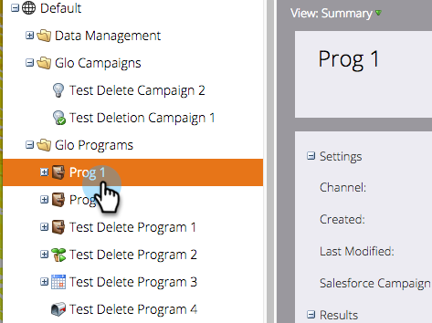

# 프로그램과 SFDC 캠페인 동기화 {#sync-an-sfdc-campaign-with-a-program}

Marketing을 사용하면 프로그램을 Salesforce 캠페인과 동기화하여 상태 등 두 시스템에서 동일한 사용자 목록을 유지할 수 있습니다. 시작합시다!

>[!NOTE]
>
>**사전 요구 사항**
>
>먼저 Salesforce 캠페인 [동기화를](../../../../product-docs/crm-sync/salesforce-sync/setup/optional-steps/enable-disable-campaign-sync.md) 활성화해야 합니다.

>[!CAUTION]
>
>SFDC 캠페인을 마케팅 프로그램과 동기화할 때 프로그램의 하위 캠페인에 대해 암시된 SFDC 작업(예: SFDC 캠페인에 추가, SFDC에 동기화)이 비활성화됩니다.

1. 마케팅 활동 **으로 이동합니다**.

   

1. 프로그램을 선택합니다.

   

1. 프로그램 **작업을**&#x200B;클릭한 다음 **Salesforce 캠페인 동기화를 선택합니다**.

   

1. **새로 만들기 **를 선택하거나 기존 Salesforce 캠페인을 선택합니다.

   >[!TIP]
   >
   >기존 Salesforce 캠페인을 선택하는 경우 Salesforce 캠페인 및 Marketing 프로그램의 프로그램 상태 [와 일치해야 합니다](../../../../product-docs/crm-sync/salesforce-sync/sfdc-sync-details/sfdc-errors/how-to-match-program-statuses-and-salesforce-campaign-statuses-prior-to-sync.md).

1. 새 캠페인의 이름을 입력하고 **저장을 클릭합니다**.

   

1. 이제 프로그램 요약 페이지에서 캠페인 동기화 세부 사항을 확인할 수 있습니다.

   

   훌륭해! 이제 Marketing의 모든 프로그램 상태 변경 사항이 SFDC 캠페인에 동기화되고 그 반대의 경우도 마찬가지입니다.

