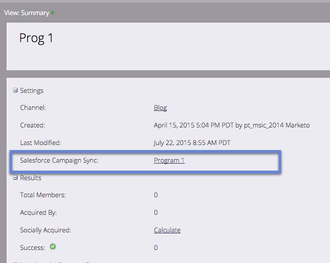

# SFDC 캠페인을 프로그램과 동기화 {#sync-an-sfdc-campaign-with-a-program}

Marketo을 사용하면 프로그램을 Salesforce 캠페인과 동기화하여 상태를 포함하여 두 시스템에 있는 동일한 사람 목록을 유지할 수 있습니다. 시작해 보겠습니다!

>[!PREREQUISITES]
>
>먼저 [Salesforce 캠페인 동기화를 활성화](/help/marketo/product-docs/crm-sync/salesforce-sync/setup/optional-steps/enable-disable-campaign-sync.md)해야 합니다.

>[!CAUTION]
>
>SFDC 캠페인을 Marketo 프로그램과 동기화할 때 프로그램의 하위 캠페인에 대해 암시된 SFDC 작업(예: SFDC Campaign에 추가, SFDC에 동기화)이 비활성화됩니다.

1. **마케팅 활동**&#x200B;으로 이동합니다.

   

1. 프로그램을 선택합니다.

   

1. **프로그램 작업**&#x200B;을 클릭한 다음 **Salesforce 캠페인 동기화**&#x200B;를 선택합니다.

   

1. **새로 만들기**&#x200B;를 선택하거나 기존 Salesforce 캠페인을 선택합니다.

   >[!TIP]
   >
   >기존 Salesforce 캠페인을 선택하는 경우 [Salesforce 캠페인과 Marketo 프로그램](/help/marketo/product-docs/crm-sync/salesforce-sync/sfdc-sync-details/how-to-match-program-statuses-and-salesforce-campaign-statuses-prior-to-sync.md)의 프로그램 상태와 일치시켜야 합니다.

1. 새 캠페인의 이름을 입력하고 **저장**&#x200B;을 클릭합니다.

   

1. 이제 프로그램 요약 페이지에서 캠페인 동기화 세부 사항을 확인할 수 있습니다.

   

   훌륭해요! 이제 Marketo의 모든 프로그램 상태 변경 사항이 SFDC 캠페인에 동기화되고 그 반대의 경우도 마찬가지입니다.
