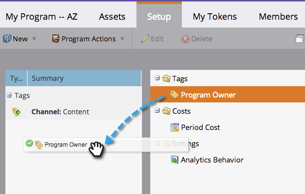
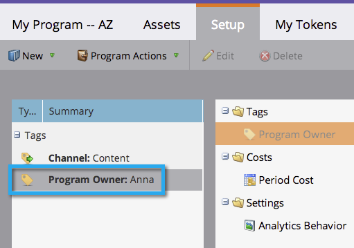
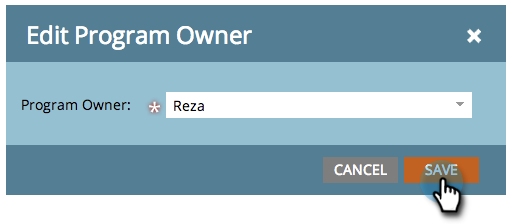

# 프로그램에서 태그 사용 {#use-tags-in-a-program}

태그는 프로그램을 설명하는 속성이며 보고에서 프로그램 유형을 그룹화하는 데 사용됩니다.

>[!NOTE]
>
>수익 주기 탐색기를 사용하는 경우 프로그램에 보고를 사용할 수 있으려면 기간 원가를 정의해야 합니다(0인 경우에도).

## 프로그램에서 태그 사용 {#use-a-tag-in-a-program}

1. 프로그램을 선택합니다. **[!UICONTROL Setup]**&#x200B;을(를) 클릭합니다.

   

1. 태그를 캔버스에 드래그하여 놓습니다.

   

1. 드롭다운에서 값을 선택합니다.

   

1. **[!UICONTROL Save]**&#x200B;을(를) 클릭합니다.

   

1. 맞습니다. 캔버스에 새 태그가 표시됩니다.

   

## 태그 편집 {#edit-a-tag}

1. **[!UICONTROL Setup]** 탭으로 이동합니다. 태그를 마우스 오른쪽 단추로 클릭합니다. **[!UICONTROL Edit]**&#x200B;를 선택합니다.

   

1. 드롭다운을 클릭합니다. 새 값을 선택합니다.

   

1. **[!UICONTROL Save]**&#x200B;을(를) 클릭합니다.

   

1. 잘됐네! 편집 내용이 캔버스에 반영됩니다.

   

## 태그 삭제  {#delete-a-tag}

1. **[!UICONTROL Setup]** 탭으로 이동합니다. 태그를 마우스 오른쪽 단추로 클릭하고 **[!UICONTROL Delete]**&#x200B;을(를) 선택합니다.

   

1. **[!UICONTROL Delete]**&#x200B;을(를) 클릭하여 확인합니다.

   

수고하셨습니다! 일관된 태그가 있는 프로그램을 사용하면 보고서를 실행할 때 작업이 훨씬 쉬워집니다.
