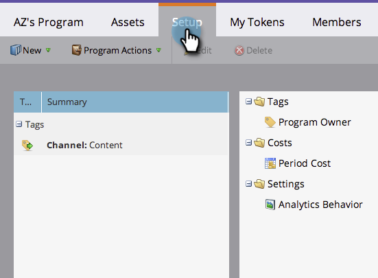

# 프로그램에서 기간 비용 사용 {#using-period-costs-in-a-program}

기간 [비용은](understanding-period-costs.md) 프로그램에서 사용하는 금액입니다. 한 달 이상 사용할 수 있으며 ROI 보고에 사용됩니다.

>[!NOTE]
>
>**딥 다이브**
>
> 매출 주기 분석에 대한 자세한 [내용을 살펴보십시오](http://docs.marketo.com/display/docs/revenue+cycle+analytics).

## 기간 비용 추가  {#add-a-period-cost}

1. 프로그램의 **설정** 탭으로 이동합니다.

   

1. 기간 **비용을** 캔버스로 드래그하여 놓습니다.

   

1. 달력 아이콘을 클릭합니다. 월을 선택합니다. 확인을 **클릭합니다**.

   

1. 기간 **비용을** 입력합니다(소수점 또는 쉼표 없이). 저장을 **클릭합니다**.

   >[!NOTE]
   >
   >이것은 추정이 될 수 있다. 정확한 금액을 알고 나면 언제든지 기간 비용을 편집할 수 있습니다(다음 섹션 참조).

   

1. 비용은 프로그램에 표시됩니다.

   

   >[!TIP]
   >
   >여러 기간 비용을 캔버스로 드래그하여 놓을 수 있습니다. 이를 통해 다양한 기간 비용과 함께 여러 달을 프로그램에 적용할 수 있습니다.

## 기간 비용 편집 {#edit-a-period-cost}

1. 원래 계획보다 많거나 적은 돈을 지출하는 경우 기간 비용을 편집할 수 있습니다.
1. 프로그램의 **설정 **탭으로 이동합니다.

   

1. 기간 비용을 **마우스 오른쪽 단추로 클릭합니다**. 편집을 **선택합니다**.

   

1. 편집 저장을 **클릭합니다**.

   

## 기간 원가 삭제 {#delete-a-period-cost}

1. 프로그램의 **설정** 탭으로 이동합니다.

   

1. 기간 비용을 **마우스 오른쪽 단추로 클릭합니다**. 삭제를 **선택합니다**.

   

1. **삭제 **를 클릭하여 확인합니다.

   

>[!NOTE]
>
>**관련 문서**
>
>* [기간 비용 이해](understanding-period-costs.md)
>* [매출 주기 분석](http://docs.marketo.com/display/docs/revenue+cycle+analytics)
>* [기간 원가로 프로그램 보고서 필터링](../../../../product-docs/core-marketo-concepts/programs/program-performance-report/filter-a-program-report-by-period-cost.md)

>

