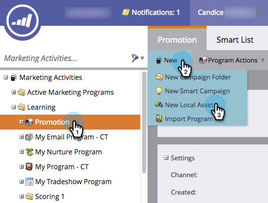

# 새 스마트 캠페인 만들기 {#create-a-new-smart-campaign}

스마트한 캠페인은 Marketing에서 가장 중요한 도구입니다. 한 사람에 대해 트리거하고 작업을 수행하거나 수백만 명의 사람을 롤업 및 일련의 흐름 단계를 실행할 수 있습니다.

>[!NOTE]
>
>**자세히 알아보기**
>
>스마트한 캠페인 여기에 [여기에 ](../../../../product-docs/core-marketo-concepts/smart-campaigns/understanding-smart-campaigns.md)에 대해 자세히 알아보십시오.

1. **마케팅 활동**&#x200B;으로 이동합니다.

   

1. **프로그램**&#x200B;을 선택한 다음 **새로 만들기**&#x200B;에서 **새 로컬 자산**&#x200B;을 클릭합니다.

   

   >[!TIP]
   >
   >모든 프로그램의 로컬 자산으로 스마트 캠페인을 만들 수 있습니다.

1. **스마트 캠페인**&#x200B;을 클릭합니다.

   

1. 스마트 캠페인 이름을 입력하고 **만들기**&#x200B;를 클릭합니다.

   

   멋지다! 다음으로 스마트 목록을 사용하여 스마트 캠페인을 통해 실행할 사람을 정의하는 방법을 알아봅니다.

   >[!NOTE]
   >
   >**관련 문서**
   >
   >    
   >    
   >    * [스마트 캠페인에 대한 스마트 목록 정의 | 일괄 처리](define-smart-list-for-smart-campaign-batch.md)
   >    * [스마트 캠페인에 대한 스마트 목록 정의 | 트리거](define-smart-list-for-smart-campaign-trigger.md)

