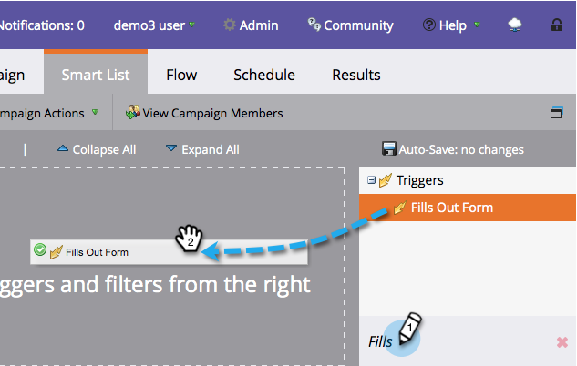

# 스마트 캠페인에 대한 스마트 목록 정의 | {#define-smart-list-for-smart-campaign-trigger} 트리거

트리거를 추가하여 라이브 이벤트를 기반으로 한 번에 한 사람씩 스마트 캠페인을 실행할 수 있습니다.

1. 스마트 캠페인에서 **스마트 목록** 탭을 클릭합니다.

   

1. 트리거를 검색한 다음 트리거를 캔버스로 드래그하여 놓습니다.

   

   >[!NOTE]
   >
   >트리거가 있는 스마트 캠페인은 **트리거** 모드에서 실행됩니다. 트리거된 이벤트와 추가 필터를 기반으로 한 번에 한 사람씩 실행됩니다.

1. 드롭다운을 클릭하고 연산자를 선택합니다.

   

   >[!CAUTION]
   >
   >빨간색 물결선은 오류나 누락된 정보를 나타냅니다. 수정되지 않으면 캠페인이 유효하지 않으며 실행되지 않습니다.

   >[!TIP]
   >
   >트리거와 필터가 모두 포함된 스마트 캠페인에서는 트리거가 맨 위로 이동하고 트리거되면 필터 기준을 충족하는 사람만 흐름을 따라 이동합니다.

1. 트리거를 정의합니다.

   

   >[!NOTE]
   >
   >트리거가 여러 개인 경우 트리거가 활성화된 경우 **ANY** 중 하나가 활성화되면 사람이 흐름을 거칩니다.

모든 사람 세트에서 동시에 캠페인을 실행하려면 [스마트 캠페인에 대한 스마트 목록 정의 방법을 알아봅니다. | 일괄 처리](/help/marketo/product-docs/core-marketo-concepts/smart-campaigns/creating-a-smart-campaign/define-smart-list-for-smart-campaign-batch.md).

>[!MORELIKETHIS]
>
>[스마트 캠페인에 흐름 단계 추가](/help/marketo/product-docs/core-marketo-concepts/smart-campaigns/flow-actions/add-a-flow-step-to-a-smart-campaign.md)
