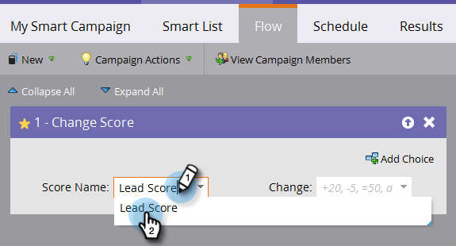

# 스마트 캠페인 {#add-a-flow-step-to-a-smart-campaign}에 흐름 단계 추가

흐름 단계는 자격을 갖춘 사람 그룹에 어떤 일이 발생하길 원하는지 Marketing에게 알려 줍니다. 그것들은 여러분의 지시이고, 스마트 캠페인은 여러분의 성공을 이룰 것입니다!

1. **마케팅 활동**&#x200B;으로 이동합니다.

   

1. 스마트 캠페인을 선택하고 **흐름**&#x200B;을 클릭합니다.

흐름 단계를 검색할 항목을 입력한 다음 캔버스로 드래그하여 놓습니다. 여러 흐름 단계를 추가할 수 있습니다. 캠페인이 수행하려는 모든 단계에서 이 단계를 반복합니다.

>[!NOTE]
>
>**자세히 알아보기**
>
>
>다른 [흐름 단계에 대해 자세히 알아보십시오](http://docs.marketo.com/display/DOCS/Flow+Actions).

1. 드롭다운을 클릭하고 적절한 옵션을 선택합니다.

   

   값을 입력합니다.

   

   >[!NOTE]
   >
   >**미리 알림**
   >
   >
   >흐름 단계는 나열된 순서대로 실행됩니다.  [흐름 단계를 ](add-a-flow-step-to-a-smart-campaign/reorder-the-flow-steps-in-a-smart-campaign.md) 다시 정렬하여 올바른 시퀀스에 있는지 확인합니다.

   >[!TIP]
   >
   >잘못된 항목이 있을 경우 빨간색 선이 표시됩니다. 줄 위로 마우스를 가져가 수정 방법을 확인합니다.

   [스마트 캠페인 검토 및 유효성 검사](../../../../product-docs/core-marketo-concepts/smart-campaigns/creating-a-smart-campaign/smart-campaign-checklist.md)

   >[!NOTE]
   >
   >**관련 문서**
   >
   >    
   >    
   >    * [흐름 단계에서 선택 추가 사용](use-add-choice-in-a-flow-step.md)
   >    * [스마트 캠페인에서 흐름 단계 순서 바꾸기](add-a-flow-step-to-a-smart-campaign/reorder-the-flow-steps-in-a-smart-campaign.md)

굉장해! 예약하거나 활성화하기 전에 반드시 수행해야 합니다.