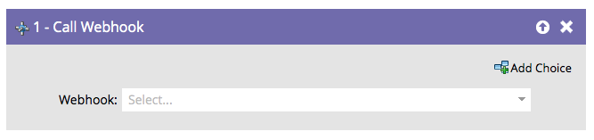

# 웹후크 호출 {#call-webhook}

>[!PREREQUISITES]
>
>[웹후크 만들기](/help/marketo/product-docs/administration/additional-integrations/create-a-webhook.md){target="_blank"}

Webhooks를 사용하면 서드파티 서비스와 상호 작용할 수 있습니다. 스마트 캠페인 플로우에서 웹후크를 호출하여 정보를 송수신하는 방법

>[!NOTE]
>
>[Webhooks](https://experienceleague.adobe.com/ko/docs/marketo-developer/marketo/webhooks/webhooks){target="_blank"}이(가) 제공하는 다양한 매혹적인 작업에 대해 알아봅니다.

1. 드롭다운에서 Webhook을 선택합니다.

그게 다야! 이제 사람들이 스마트 캠페인 흐름에 들어갈 때마다 웹후크가 호출됩니다.

>[!MORELIKETHIS]
>
>[스마트 캠페인에서 웹후크 사용](/help/marketo/product-docs/core-marketo-concepts/smart-campaigns/flow-actions/use-a-webhook-in-a-smart-campaign.md){target="_blank"}
