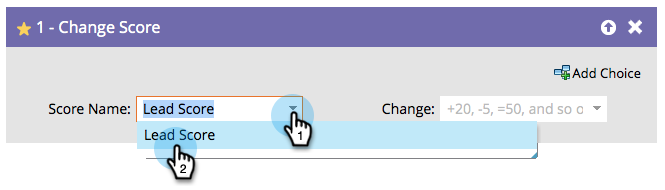

# 점수 변경 {#change-score}

직원의 점수를 매기는 것은 쉽고 강력하며 영업팀이 우선 순위를 매기도록 도와줍니다.

1. 변경할 점수 필드를 선택합니다.

   

   >[!TIP]
   >
   >여러 점수 필드를 만들 수 있습니다. 자세한 내용은 [Marketo에서 사용자 지정 필드 만들기](/help/marketo/product-docs/administration/field-management/create-a-custom-field-in-marketo.md){target="_blank"}를 참조하십시오.

1. 원하는 점수 변경 사항을 입력합니다.

   

   변경 사항:

   * 증가하려면 **+5**
   * **-5**&#x200B;이(가) 감소합니다(음수 허용).
   * **=5**&#x200B;이(가) 해당 숫자를 채점합니다.
   * **=-5**&#x200B;이면 점수가 정확히 음수가 됩니다.

몇 가지 기본 점수를 빠르게 얻은 다음 시간에 따라 결과를 조정합니다.
