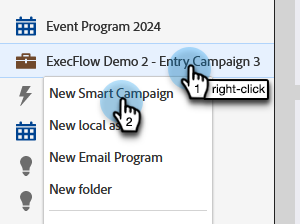

# 캠페인 실행 {#execute-campaign}

실행 가능한 캠페인은 다른 캠페인과 마찬가지로 스마트 목록, 흐름 및 일정을 포함합니다. 다른 캠페인과 달리 실제로 예약하거나 활성화하지는 않습니다. 캠페인 실행 흐름 단계를 통해서만 다른 캠페인에 의해 호출될 수 있습니다. 실행 가능한 캠페인의 흐름 단계는 상위 캠페인과 함께 직렬로 실행됩니다(별도의 트리거 캠페인에서 동시에 실행되는 요청 캠페인과 달리).

>[!NOTE]
>
>실행 가능한 캠페인은 항상 이를 호출하는 (상위) 캠페인의 하위 캠페인입니다.

## 캠페인 실행을 사용해야 하는 경우 {#when-to-use-execute-campaign}

실행 가능한 캠페인으로 수행할 수 있는 작업은 여러 가지가 있습니다. 리드 라우팅, 라이프사이클 관리 및 채점(기타)과 같은 일반적인 운영 작업을 용이하게 하도록 설계되었으며 배치 또는 트리거된 캠페인 내에서 동일한 워크플로우를 실행하는 데 사용할 수 있습니다.

별도의 플로우를 실행해야 하는 경우에도 사용할 수 있지만 후속 플로우 단계 선택 시 해당 플로우의 결과에 의존해야 합니다(예: 이 경우 그렇게 함).

Campaign 실행은 직렬로 실행할 수 있으므로 [Request Campaign](/help/marketo/product-docs/core-marketo-concepts/smart-campaigns/flow-actions/request-campaign.md)에 대한 개선 사항이 있습니다. 반면 후자는 병렬로 실행됩니다.

>[!NOTE]
>
>대기 단계 및 웹후크는 실행 가능한 캠페인과 호환되지 않습니다. 이러한 경우에는 요청 캠페인을 대신 사용해야 합니다.

## 실행 가능한 캠페인을 만드는 방법 {#how-to-create-an-executable-campaign}

1. 원하는 프로그램을 마우스 오른쪽 단추로 클릭하고 **[!UICONTROL 새 스마트 캠페인]**&#x200B;을 선택합니다.

   

1. 이름을 지정하고 **[!UICONTROL 실행 파일]** 확인란을 선택한 다음 **[!UICONTROL 만들기]**&#x200B;를 클릭합니다.

   

1. 다른 스마트 캠페인과 마찬가지로 스마트 목록 및 흐름을 정의합니다.

기존 Smart Campaign을 복제할 수도 있습니다. 기존 실행 가능 캠페인을 복제하는 경우에도 이름을 지정한 후 **[!UICONTROL 실행 가능]** 확인란을 선택해야 합니다.

>[!NOTE]
>
>트리거가 포함된 캠페인을 복제할 수 없습니다.

## 상위 캠페인 토큰 컨텍스트 사용 {#use-parent-campaign-token-context}

true로 설정하면 다음 토큰 컨텍스트가 하위 캠페인(실행 중인 토큰 캠페인)으로 전송됩니다.

* 내 토큰
* 캠페인 토큰
* 프로그램 토큰
* 멤버 토큰
* [트리거 토큰](/help/marketo/product-docs/marketo-sales-insight/msi-for-salesforce/features/tabs-in-the-msi-panel/interesting-moments/trigger-tokens-for-interesting-moments.md)(트리거된 캠페인에서 호출되는 경우)

**API 상호 작용**

API[&#128279;](https://experienceleague.adobe.com/ko/docs/marketo-developer/marketo/rest/assets/smart-campaigns#batch)에서  일정 또는 요청 캠페인을 사용할 때 두 옵션을 사용하면 [내 토큰] 값을 전달할 수 있습니다. 이 값은 호출하는 캠페인의 해당 토큰에 대해 설정된 값을 재정의합니다. 그런 다음 Campaign이 다른 캠페인을 실행하고 &quot;상위 컨텍스트 사용을 True로&quot; 설정하면 애플리케이션에 설정된 값이 아니라 API를 통해 전달된 값이 사용됩니다.

## 참고할 사항 {#things-to-note}

* 스마트 목록은 자격이 없는 사람을 필터링합니다. 개인이 적격한 경우, 실행된 캠페인 활동 결과로 &quot;적격: TRUE&quot;(및 그렇지 않은 경우 FALSE)로 표시됩니다.
* 일정 캠페인 자격 규칙 적용(일정 탭의 스마트 캠페인 설정)
* 작업 공간 전체에서 실행 가능한 캠페인을 호출할 수 없습니다.
* 실행 가능한 캠페인을 대상으로 하는 [흐름에서 제거](/help/marketo/product-docs/core-marketo-concepts/smart-campaigns/flow-actions/remove-from-flow.md) 흐름 작업을 사용하는 경우, 하위 캠페인과 상위 캠페인 모두를 대상으로 합니다.
* 토큰 상속의 이점 - 예를 들어, 여러 다른 에셋에 의해 트리거되는 단일 공통 점수 흐름이 있는 경우 상위 캠페인에 대해 하위 점수 캠페인 값을 재정의할 수 있도록 하위 캠페인 및 상위 캠페인에서 기본 내 토큰 점수를 정의할 수 있습니다(아래 시각적 예 참조)
* 실행 가능한 캠페인은 최대 3단계 깊이(예: 상위 캠페인 > 하위 > 하위 > 하위)까지 호출할 수 있습니다.

>[!CAUTION]
>
>실행 가능한 캠페인에 대한 스마트 목록을 유효하지 않은 상태로 두지 마십시오. 그렇지 않으면 _아무도_&#x200B;하지 않습니다. 가장 좋은 방법은 별도의 스마트 목록 자산을 만들고 완전히 정의하고 자산이 유효한지 확인하는 것입니다. 그런 다음 실행 가능한 캠페인에서 &quot;스마트 목록 구성원&quot; 필터를 사용하여 스마트 목록 정의를 교환할 수 있습니다.

## 토큰 상속 예 {#token-inheritance-example}

다음은 하나의 실행 가능한 캠페인과 두 개의 상위 캠페인의 토큰 상속의 시각적 예입니다. 하나는 토큰 컨텍스트가 **[!UICONTROL True]**(으)로 설정되어 있고 다른 하나는 **[!UICONTROL False]**(으)로 설정되어 있습니다.

토큰화된 변경 점수가 있는 하위 캠페인.

어린이 캠페인은 나의 토큰입니다.

### 예제 1 - True {#example-one-true}

첫 번째 상위 캠페인의 캠페인 실행 흐름 단계에서 &quot;상위 캠페인 토큰 컨텍스트 사용&quot;이 **True**(으)로 설정됩니다.

상위 캠페인의 내 토큰입니다.

결과: 점수가 +10만큼 변경되었습니다.

### 예제 2: False {#example-two-false}

두 번째 상위 캠페인의 캠페인 실행 흐름 단계에서 &quot;상위 캠페인 토큰 컨텍스트 사용&quot;이 **False**(으)로 설정됩니다.

상위 캠페인의 내 토큰입니다.

결과: 점수가 변경되지 않았습니다. 하위 캠페인의 점수 값 +0이 사용되었기 때문입니다.

